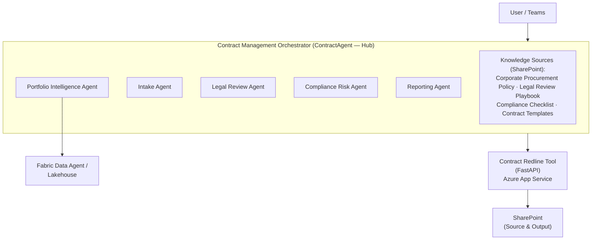
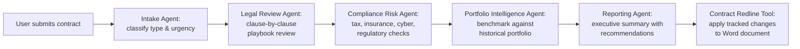
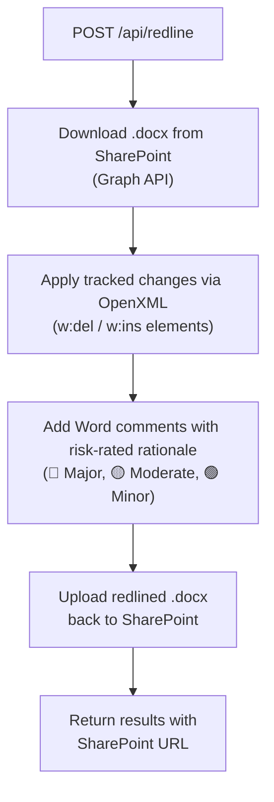

# Contract Agent

A multi-agent contract lifecycle management system built on Microsoft Copilot Studio, with a Python microservice for automated document redlining. The solution reduces contract review cycles from months to hours by orchestrating specialized AI agents for intake classification, legal review, compliance risk assessment, portfolio benchmarking, and executive reporting.

## Architecture



### Review Pipeline



## Repository Structure

```
ContractAgent/
├── .github/                                  # Copilot instructions and project guidance
├── .gitignore
├── Azure/
│   └── ContractRedlineTool/                  # FastAPI redline microservice + deployment assets
│       ├── app/                              # Application code (routers, services, models)
│       ├── deploy/                           # App Service/Bicep deployment configuration
│       ├── tests/                            # Pytest suite
│       ├── Dockerfile
│       ├── openapi.json
│       ├── swagger.yml
│       └── requirements.txt
├── CopilotStudio/
│   └── Contract Review Agent (Embedded)/     # Copilot Studio agent package
│       ├── actions/                          # Connected actions (Fabric, Redline, Outlook)
│       ├── agents/                           # Connected sub-agents
│       ├── topics/                           # Conversation topics and orchestration flows
│       ├── trigger/
│       ├── workflows/
│       ├── agent.mcs.yml
│       └── settings.mcs.yml
├── Documentation/                            # Solution architecture and requirements docs
│   ├── design.md
│   ├── redline-tool.md
│   ├── requirements.md
│   └── solution.md
├── Documents/                                # Source contracts, policies, and templates
│   ├── Compliance/
│   │   ├── compliance-checklist.docx
│   │   └── corporate-procurement-policy.docx
│   ├── Contracts/
│   │   ├── sample-contract-compliant.docx
│   │   ├── sample-contract-expired-terms.docx
│   │   ├── sample-contract-high-risk.docx
│   │   └── sample-contract-missing-clauses.docx
│   ├── Legal/
│   │   └── legal-review-playbook.docx
│   └── Templates/
│       ├── contract-template-nda.docx
│       └── contract-template-vendor-agreement.docx
├── Fabric/
│   ├── Data/                                 # Lakehouse sample CSV data
│   │   ├── contracts.csv
│   │   ├── contract_clauses.csv
│   │   ├── vendors.csv
│   │   ├── compliance_incidents.csv
│   │   └── spend_actuals.csv
│   ├── Example queries.md
│   └── Instructions.md
├── CODE_OF_CONDUCT.md
├── LICENSE
├── SECURITY.md
└── README.md
```

## Copilot Studio Agents

This repo contains an embedded Copilot Studio package: `Contract Review Agent (Embedded)` (`schemaName: cr57c_ContractReviewAgentEmbedded`).

The orchestrator uses:

- `GenerativeAIRecognizer`
- `GenerativeActionsEnabled: true`
- `modelNameHint: opus4-1`

### Embedded Orchestration Flow

The orchestrator runs an end-to-end automated pipeline when a SharePoint file event triggers the workflow:

1. Extract contract text (`ContractRedlineTool-ExtractplaintextfromaWorddocument`)
2. Run connected sub-agents (Intake, Compliance Risk, Legal Review)
3. Route key terms to `ContractPortfolioIntelligence` for benchmarking
4. Merge recommendations and apply tracked changes (`ContractRedlineTool-Redlineacontractwithtrackedchanges`)
5. Compile final summary via Reporting Agent
6. Send output email (`Office365Outlook-SendanemailV2`)

### Connected Sub-Agents

| Folder | Component Name | Role |
|---|---|---|
| `agents/Agent/` | Intake Agent | Classifies contract type/urgency and routes required review domains |
| `agents/Agent_0Jj/` | Compliance Risk Agent | Evaluates tax, insurance, cybersecurity, and regulatory gaps |
| `agents/Agent_k9d/` | Legal Review Agent | Reviews clause language against legal playbook and policy |
| `agents/Agent_UK_/` | Reporting Agent | Produces executive summary and actionable recommendations |

### Connected Actions

| Action File | Purpose |
|---|---|
| `actions/ContractRedlineTool-ExtractplaintextfromaWorddocument.mcs.yml` | Extract raw text from uploaded Word contracts |
| `actions/ContractRedlineTool-Redlineacontractwithtrackedchanges.mcs.yml` | Apply merged recommendations as Word tracked changes |
| `actions/ContractPortfolioIntelligence.mcs.yml` | Retrieve portfolio benchmarks and vendor/compliance insights |
| `actions/Office365Outlook-SendanemailV2.mcs.yml` | Send review output and redline link to uploader |

### System Topics in Package

The embedded package currently includes standard Copilot topics under `topics/`:

`ConversationStart`, `Greeting`, `Search`, `Fallback`, `OnError`, `Escalate`, `Signin`, `StartOver`, `ResetConversation`, `ThankYou`, `Goodbye`, `MultipleTopicsMatched`, `EndofConversation`.

## Contract Redline Tool

A Python FastAPI microservice that applies tracked changes to Word documents stored in SharePoint.

### How It Works



### API Reference

#### `POST /api/redline`

**Headers:** `X-API-Key: <your-api-key>`

**Request Body:**
```json
{
  "document_url": "https://contoso.sharepoint.com/sites/Procurement/Shared Documents/contract.docx",
  "recommendations": [
    {
      "original_text": "Net 45 days",
      "replacement_text": "Net 30 days",
      "rationale": "Policy requires Net 30 for contracts under $500K",
      "risk_level": "major",
      "section": "Payment Terms"
    }
  ],
  "author": "Contract Review Agent",
  "output_filename": "contract-redlined",
  "output_folder_url": "https://contoso.sharepoint.com/sites/Procurement/Shared Documents/Redlined/"
}
```

**Response:**
```json
{
  "status": "success",
  "output_url": "https://contoso.sharepoint.com/...",
  "changes_applied": 1,
  "changes_failed": 0,
  "comments_added": 1,
  "results": [
    {
      "original_text": "Net 45 days",
      "replacement_text": "Net 30 days",
      "applied": true,
      "comment_added": true,
      "error": ""
    }
  ],
  "summary": "Applied 1/1 tracked changes with 1 rationale comments."
}
```

#### `GET /health`

Returns `{"status": "healthy", "version": "1.0.0", "service": "Contract Redline Tool"}`.

### Supported URL Formats

- **Direct SharePoint URLs:** `https://contoso.sharepoint.com/sites/Site/Shared Documents/file.docx`
- **Sharing links:** `https://contoso.sharepoint.com/:w:/s/Site/EaBc...?e=token` (resolved via Graph `/shares` API)

### Local Development

```bash
cd ContractRedlineTool
python -m venv .venv
.venv/Scripts/activate      # Windows
# source .venv/bin/activate  # Linux/macOS

pip install -r requirements.txt
cp .env.example .env         # Configure Azure credentials
python -m uvicorn app.main:app --reload --port 8000
```

**Environment Variables (`.env`):**

| Variable | Description | Required |
|---|---|---|
| `AZURE_TENANT_ID` | Entra ID tenant ID | For local dev |
| `AZURE_CLIENT_ID` | App registration client ID | For local dev |
| `AZURE_CLIENT_SECRET` | App registration secret | For local dev (if not using cert) |
| `AZURE_CLIENT_CERTIFICATE_PATH` | Path to `.pfx` certificate file | For local dev (if secrets disabled) |
| `AZURE_CLIENT_CERTIFICATE_PASSWORD` | Certificate password | If cert is password-protected |
| `API_KEY` | API key for `X-API-Key` header | Yes (empty string disables auth) |
| `TEMP_DIR` | Temp directory for file processing | No (default: `/tmp/redline`) |

In production (Azure App Service), authentication uses the system-assigned Managed Identity via `DefaultAzureCredential` — no `AZURE_TENANT_ID` or `AZURE_CLIENT_ID` needed.

### Running Tests

```bash
cd ContractRedlineTool
pytest                                  # Full suite
pytest tests/test_redline_engine.py     # Redline engine tests
pytest tests/test_api.py                # API endpoint tests
pytest -k "test_apply_single_change"    # Single test
```

Tests create real `.docx` files using `tmp_path` and verify OpenXML output. Graph API calls are mocked with `unittest.mock.patch`.

### Docker

```bash
docker build -t contract-redline-tool .
docker run -p 8000:8000 --env-file .env contract-redline-tool
```

### Deploy to Azure App Service

**Infrastructure (Bicep):**

```bash
az deployment group create \
  --resource-group rg-contract-agent \
  --template-file deploy/bicep/main.bicep \
  --parameters namePrefix=contract-redline
```

This creates a Linux App Service (Python 3.11, B1 SKU) with system-assigned Managed Identity, HTTPS-only, TLS 1.2, and FTP disabled.

**Code deployment:**

```bash
cd ContractRedlineTool
az webapp up --name <app-name> --resource-group <rg-name> --runtime "PYTHON:3.11" --sku B1
```

**Post-deployment — Grant Graph API permissions to Managed Identity:**

The Managed Identity needs `Sites.ReadWrite.All` and `Files.ReadWrite.All` application permissions on Microsoft Graph. Use `az rest` to assign app roles (requires Global Administrator or Privileged Role Administrator):

```powershell
# Get the Managed Identity principal ID from Bicep output or:
az webapp identity show --name <app-name> --resource-group <rg-name> --query principalId -o tsv

# Get the Graph service principal object ID:
az ad sp show --id 00000003-0000-0000-c000-000000000000 --query id -o tsv

# Look up correct app role IDs:
az ad sp show --id 00000003-0000-0000-c000-000000000000 \
  --query "appRoles[?value=='Sites.ReadWrite.All'].id" -o tsv

# Grant via az rest (repeat for each permission):
$body = @{
  principalId = "<managed-identity-principal-id>"
  resourceId  = "<graph-sp-object-id>"
  appRoleId   = "<app-role-id>"
} | ConvertTo-Json
$body | Out-File grant.json -Encoding utf8
az rest --method POST \
  --uri "https://graph.microsoft.com/v1.0/servicePrincipals/<graph-sp-object-id>/appRoleAssignments" \
  --headers "Content-Type=application/json" \
  --body @grant.json
```

**Configure app settings:**

```bash
az webapp config appsettings set --name <app-name> --resource-group <rg-name> \
  --settings API_KEY=<your-key> TEMP_DIR=/tmp/redline DEBUG=false
```

## Knowledge Sources

The orchestrator agent references four SharePoint-linked knowledge sources (in `ContractAgent/knowledge/`) for RAG-style grounding. These connect to:

- **Corporate Procurement Policy** — Approval thresholds, mandatory clauses, prohibited terms
- **Legal Review Playbook** — 26-item clause checklist, risk classification matrix, approved alternative language
- **Compliance Checklist** — Tax, insurance, cybersecurity, regulatory requirements
- **Contract Templates** — NDA and Vendor Services Agreement templates

Agents must cite specific policy sections. If guidance isn't found in knowledge sources, agents respond with: *"I don't have specific guidance for that in Contoso's policies. Please consult the Legal or Compliance team directly."*

## Fabric Lakehouse Setup

The Portfolio Intelligence Agent queries a Microsoft Fabric lakehouse. Sample data is in `documentation/sample-data/fabric/`:

| Table | Rows | Description |
|---|---|---|
| `contracts` | 54 | Master contract records (type, value, status, expiration, payment terms, risk rating) |
| `contract_clauses` | 288 | Clause-level detail (clause type, compliance, deviation type, risk score) |
| `vendors` | 20 | Vendor master (tier, compliance score, country, active contracts) |
| `compliance_incidents` | 34 | Historical incidents (type, severity, financial impact) |
| `spend_actuals` | 195 | Budget vs. actual spend by quarter (variance, department, category) |

**Relationships:** `contracts.vendor_id` → `vendors.vendor_id`; `contracts.contract_id` → `contract_clauses`, `compliance_incidents`, `spend_actuals`.

### Setup Steps

1. Create a lakehouse (`ContractPortfolioLH`) in a Fabric workspace (requires F2+ capacity)
2. Upload the five CSVs and load as Delta tables
3. Create a Fabric Data Agent, select all five tables
4. Add data agent instructions (schema descriptions and join guidance)
5. Add example SQL queries for common questions
6. Publish and connect to the orchestrator in Copilot Studio

See [`.github/copilot-instructions.md`](.github/copilot-instructions.md) for detailed step-by-step instructions including example queries and SQL.

## Personas

Four stakeholder personas are defined in `persona/` for scenario testing and demo flows:

| Persona | Role | Primary Agents |
|---|---|---|
| Laila Tuilagi | Senior Procurement Officer | Intake, Portfolio Intelligence, Redline Tool |
| Kwame Osei-Mensah | Associate General Counsel | Legal Review, Portfolio Intelligence, Redline Tool |
| Elena Vasquez | Chief Compliance Officer | Compliance & Risk, Portfolio Intelligence |
| James Chen | VP of Finance | Portfolio Intelligence, Reporting |

## Sample Data

The `documentation/sample-data/` directory contains test contracts and policy documents:

| File | Purpose |
|---|---|
| `sample-contract-compliant.md` | Fully compliant vendor agreement (baseline) |
| `sample-contract-high-risk.md` | Contract with prohibited terms (unlimited liability, etc.) |
| `sample-contract-expired-terms.md` | Contract with outdated certifications and terms |
| `sample-contract-missing-clauses.md` | Contract missing critical required clauses |
| `corporate-procurement-policy.md` | Contoso procurement policy with approval thresholds |
| `legal-review-playbook.md` | 26-item clause checklist with risk matrix |
| `compliance-checklist.md` | Multi-domain compliance requirements |
| `contract-template-nda.md` | Standard NDA template |
| `contract-template-vendor-agreement.md` | Standard vendor agreement template |
| `test-scenarios.md` | End-to-end test scenarios for all agent flows |

## Conventions

- **Risk Classification:** Three-tier system used across all agents — Major (🔴), Moderate (🟡), Minor (🟢). Maps to the `RiskLevel` enum in the Redline Tool.
- **Policy Grounding:** All agents cite specific policy/playbook sections. No general model knowledge for contract-specific guidance.
- **Agent Files:** All use `.mcs.yml` extension. Connected agents use `AgentDialog` kind with `OnToolSelected` triggers.
- **Orchestrator Schema:** `cr57c_agentqf4ruA` — appears in knowledge source filenames and settings.
- **Redline Tool Auth:** API key via `X-API-Key` header (empty key disables validation in dev). Production uses Managed Identity for Graph API.
- **Graph API Permissions:** `Sites.ReadWrite.All` and `Files.ReadWrite.All` (application type) required for SharePoint operations.

## Technology Stack

| Component | Technology |
|---|---|
| Agent Platform | Microsoft Copilot Studio |
| Agent Model | opus4-1 |
| Knowledge Grounding | SharePoint + Copilot Studio RAG |
| Portfolio Analytics | Microsoft Fabric Lakehouse + Data Agent |
| Redline Microservice | Python 3.11, FastAPI, uvicorn, gunicorn |
| Document Manipulation | python-docx, lxml (OpenXML) |
| SharePoint Integration | Microsoft Graph API, azure-identity, httpx |
| Infrastructure as Code | Bicep |
| Hosting | Azure App Service (Linux, B1 SKU) |
| Authentication | System-assigned Managed Identity (prod), Certificate/Secret (dev) |
| Testing | pytest, pytest-asyncio, FastAPI TestClient |


_This project is provided as sample code for learning purposes only.
It is not production-ready, is provided "as is", and is not supported by Microsoft._
