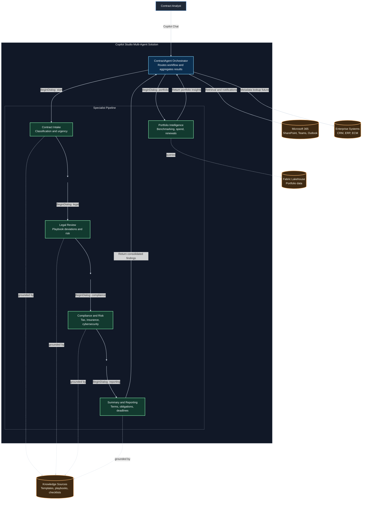
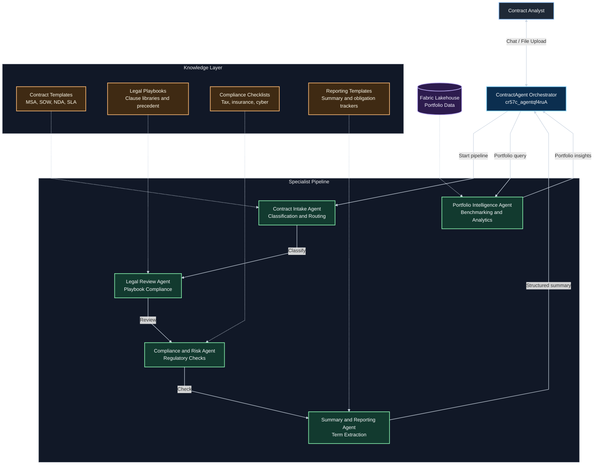
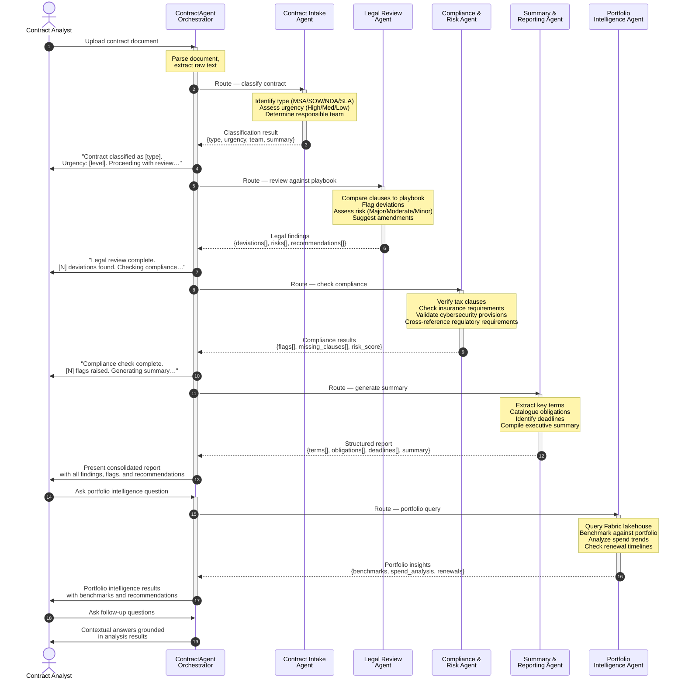
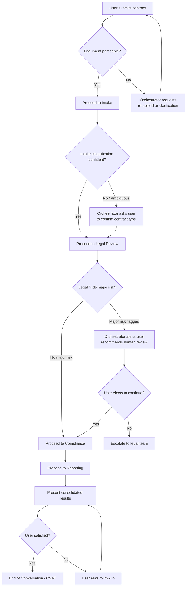
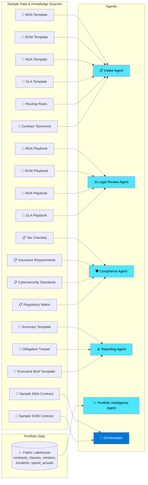
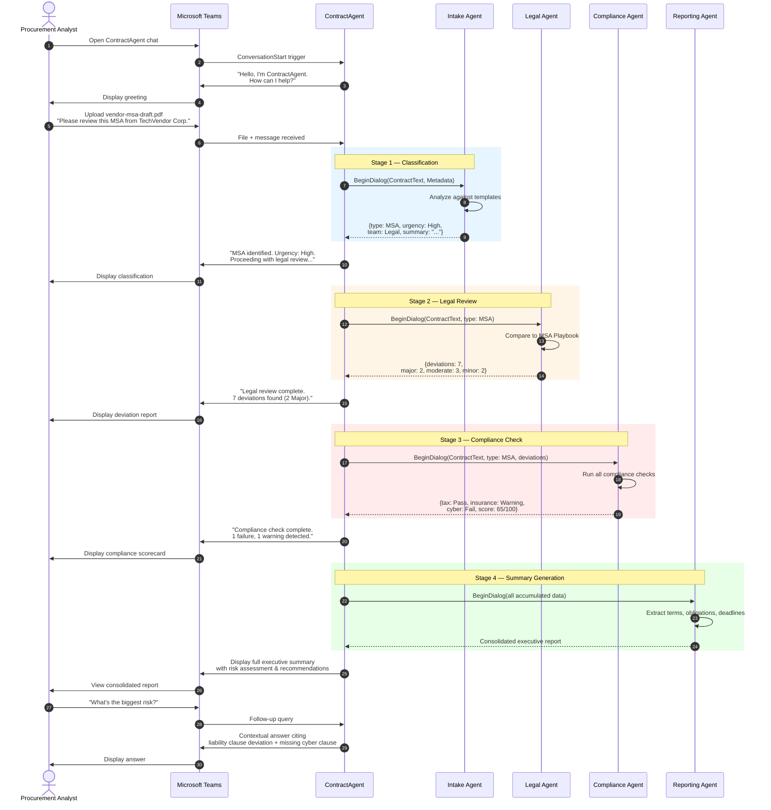

# Contoso Contract Management — Architecture Design Document

> **Multi-Agent Copilot Studio Solution**
> Version 1.0 · Draft
> Solution Schema: `cr57c_agentqf4ruA`

---

## Table of Contents

1. [Executive Summary](#1-executive-summary)
2. [Solution Architecture Overview](#2-solution-architecture-overview)
3. [Agent Topology](#3-agent-topology)
4. [Conversation Flow](#4-conversation-flow)
5. [Agent Specifications](#5-agent-specifications)
6. [Knowledge Architecture](#6-knowledge-architecture)
7. [Data Flow](#7-data-flow)
8. [Demo Workflow](#8-demo-workflow)
9. [Technology Stack](#9-technology-stack)
10. [Appendix — Glossary & References](#10-appendix--glossary--references)

---

## 1. Executive Summary

### Problem Statement

Contoso's contract lifecycle currently spans **4–5 months** from initiation to execution. Key bottlenecks exist at the drafting, review, and dispatch stages, with institutional knowledge trapped in siloed systems and undocumented tribal practices. The review process demands coordination across legal, compliance, procurement, and business stakeholders — each applying domain-specific policies that are inconsistently enforced.

### Proposed Solution

A **multi-agent Copilot Studio solution** that decomposes the contract review lifecycle into five specialized sub-agents, orchestrated by a central coordinator. Each agent is grounded in authoritative knowledge sources — playbooks, templates, regulatory checklists, and portfolio data — eliminating reliance on tribal knowledge and delivering deterministic, policy-aligned analysis.

### Target Outcome

Reduce contract cycle time to approximately **1 month** by automating classification, legal review, compliance checking, and summary extraction — while preserving human oversight at each decision point.

---

## 2. Solution Architecture Overview

The solution follows a **hub-and-spoke multi-agent pattern** in Microsoft Copilot Studio. The orchestrator agent (`ContractAgent`) acts as the single user-facing entry point, delegating specialized tasks to five child agents via the connected agents framework.

### 2.1 Component Architecture



### 2.2 Design Principles

| Principle | Description |
|---|---|
| **Policy-Grounded Agents** | Every agent decision is anchored to an uploaded knowledge source — no model hallucination or tribal knowledge. |
| **Single Responsibility** | Each sub-agent owns exactly one domain; the orchestrator owns workflow coordination only. |
| **Human-in-the-Loop** | Agents flag findings and recommendations; humans make final accept/reject decisions. |
| **Composability** | Sub-agents are independently testable and deployable; new agents (e.g., Financial Review) can be added without modifying existing ones. |
| **Deterministic Routing** | The orchestrator follows a fixed pipeline (Intake → Legal → Compliance → Reporting) with on-demand portfolio intelligence to ensure consistent processing. |

---

## 3. Agent Topology

### 3.1 Agent Relationship Diagram



### 3.2 Agent Communication Model

All inter-agent communication uses the Copilot Studio **connected agents** pattern:

- The orchestrator invokes sub-agents via `BeginDialog` actions targeting the child agent's topic.
- Sub-agents receive context through **global variables** set by the orchestrator (contract text, metadata, prior findings).
- Sub-agents return structured results via **output variables** that the orchestrator reads upon dialog completion.
- Sub-agents **never** communicate directly with each other — all coordination flows through the orchestrator.

---

## 4. Conversation Flow

### 4.1 End-to-End Sequence



### 4.2 Error & Escalation Flow



---

## 5. Agent Specifications

### 5.1 ContractAgent — Orchestrator

| Attribute | Detail |
|---|---|
| **Schema Name** | `cr57c_agentqf4ruA` |
| **Role** | Central coordinator and user-facing entry point |
| **Recognizer** | `GenerativeAIRecognizer` |
| **Authentication** | Integrated (Always), Group Membership access control |

**Purpose & Responsibilities**

- Serve as the single conversational interface for contract analysts.
- Accept contract document uploads and parse document content.
- Execute the four-stage review pipeline: Intake → Legal → Compliance → Reporting, plus on-demand portfolio intelligence queries.
- Aggregate findings from all sub-agents into a unified response.
- Manage conversation state, context passing, and error handling.
- Support follow-up questions grounded in accumulated analysis.

**Key Topics**

| Topic | Type | Purpose |
|---|---|---|
| `ContractReview` | Custom (to build) | Main pipeline — routes through all 4 review sub-agents |
| `ContractQuery` | Custom (to build) | Ad-hoc questions about a previously analyzed contract |
| `PortfolioQuery` | Custom (to build) | Portfolio intelligence — benchmarking, spend analytics, renewals |
| `ConversationStart` | System | Greeting and initial instructions |
| `Search` | System | Conversational boosting from knowledge sources |
| `Escalate` | System | Human handoff for unresolvable issues |
| `Fallback` | System | Graceful handling of unrecognized input |

**Input/Output Contract**

| Direction | Data | Format |
|---|---|---|
| **Input** | Contract document (PDF/DOCX/text) | File upload or pasted text |
| **Input** | User questions and instructions | Natural language |
| **Output** | Classification summary | Structured text |
| **Output** | Legal deviation report | Structured text with risk ratings |
| **Output** | Compliance flag report | Structured text with risk ratings |
| **Output** | Executive summary with key terms, obligations, deadlines | Structured text |

**Routing Triggers**

| Trigger | Condition | Target |
|---|---|---|
| Contract uploaded | Document detected in user message | → Intake Agent |
| Classification complete | Intake returns result | → Legal Review Agent |
| Legal review complete | Legal returns findings | → Compliance Agent |
| Compliance check complete | Compliance returns flags | → Reporting Agent |
| Portfolio question | User asks about benchmarks, spend, or renewals | → Portfolio Intelligence Agent |
| Follow-up question | User asks about prior analysis | → Search (knowledge-grounded) |

---

### 5.2 Contract Intake Agent

| Attribute | Detail |
|---|---|
| **Role** | Contract classification, urgency assessment, team routing |
| **Type** | Connected child agent |

**Purpose & Responsibilities**

- Determine the contract type (MSA, SOW, NDA, SLA, Amendment, Other).
- Assess urgency based on deadline proximity, counterparty importance, and clause complexity.
- Identify the responsible review team (Legal, Procurement, IT, Finance).
- Produce a preliminary contract summary highlighting scope, parties, and effective dates.

**Knowledge Sources**

| Source | Content | Format |
|---|---|---|
| `contract-templates/` | Sample MSA, SOW, NDA, SLA templates | DOCX/PDF |
| `routing-rules.md` | Decision matrix: type × urgency → team assignment | Markdown |
| `contract-taxonomy.md` | Classification criteria and definitions | Markdown |

**Key Topics**

| Topic | Trigger | Behavior |
|---|---|---|
| `ClassifyContract` | Invoked by orchestrator | Analyzes document, returns classification |
| `AssessUrgency` | Chained from classification | Evaluates urgency signals |

**Input/Output Contract**

| Direction | Data | Type |
|---|---|---|
| **Input** | `Global.ContractText` | String (full document text) |
| **Input** | `Global.SubmissionMetadata` | Object (submitter, date, source system) |
| **Output** | `Global.ContractType` | Enum: MSA, SOW, NDA, SLA, Amendment, Other |
| **Output** | `Global.UrgencyLevel` | Enum: High, Medium, Low |
| **Output** | `Global.AssignedTeam` | String (team name) |
| **Output** | `Global.IntakeSummary` | String (preliminary summary) |

---

### 5.3 Legal Review Agent

| Attribute | Detail |
|---|---|
| **Role** | Clause-by-clause review against legal playbooks |
| **Type** | Connected child agent |

**Purpose & Responsibilities**

- Compare each contract clause against the applicable legal playbook for the identified contract type.
- Flag deviations from standard language (additions, deletions, modifications).
- Classify each deviation by risk level: **Major** (requires senior counsel), **Moderate** (requires negotiation), **Minor** (acceptable with notation).
- Suggest alternative clause language from the playbook where deviations are found.
- Identify missing standard clauses that should be present.

**Knowledge Sources**

| Source | Content | Format |
|---|---|---|
| `playbooks/msa-playbook.md` | Master Service Agreement review playbook | Markdown |
| `playbooks/sow-playbook.md` | Statement of Work review playbook | Markdown |
| `playbooks/nda-playbook.md` | Non-Disclosure Agreement review playbook | Markdown |
| `playbooks/sla-playbook.md` | Service Level Agreement review playbook | Markdown |
| `clause-library/` | Approved clause variants by category | Markdown/DOCX |

**Key Topics**

| Topic | Trigger | Behavior |
|---|---|---|
| `ReviewAgainstPlaybook` | Invoked by orchestrator with contract type + text | Clause-by-clause comparison |
| `FlagDeviations` | Chained from review | Categorizes and explains deviations |
| `SuggestAmendments` | Chained from flagging | Proposes alternative language |

**Input/Output Contract**

| Direction | Data | Type |
|---|---|---|
| **Input** | `Global.ContractText` | String |
| **Input** | `Global.ContractType` | Enum (from Intake) |
| **Output** | `Global.Deviations` | Array of {clause, deviation, riskLevel, suggestion} |
| **Output** | `Global.MissingClauses` | Array of {clauseName, importance} |
| **Output** | `Global.LegalRiskSummary` | String (narrative summary) |

**Risk Classification Matrix**

| Risk Level | Criteria | Action Required |
|---|---|---|
| 🔴 **Major** | Liability cap removed, indemnity broadened, IP assignment changed, governing law altered | Escalate to senior counsel; do not proceed without amendment |
| 🟡 **Moderate** | Payment terms non-standard, SLA penalties weakened, termination notice shortened | Flag for negotiation; provide alternative language |
| 🟢 **Minor** | Formatting differences, synonym substitutions, minor date adjustments | Note for record; no action required |

---

### 5.4 Compliance & Risk Agent

| Attribute | Detail |
|---|---|
| **Role** | Regulatory, tax, insurance, and cybersecurity compliance validation |
| **Type** | Connected child agent |

**Purpose & Responsibilities**

- Verify presence and adequacy of **tax clauses** (withholding, Sales Tax, transfer pricing).
- Check **insurance requirements** (minimum coverage, certificate of insurance, named insured).
- Validate **cybersecurity and data protection provisions** (breach notification, data handling, encryption standards).
- Cross-reference **regulatory requirements** specific to the contract's jurisdiction and industry.
- Produce a compliance scorecard with pass/fail/warning for each category.

**Knowledge Sources**

| Source | Content | Format |
|---|---|---|
| `compliance/tax-checklist.md` | domestic and international tax clause requirements | Markdown |
| `compliance/insurance-requirements.md` | Minimum insurance thresholds by contract type and value | Markdown |
| `compliance/cybersecurity-standards.md` | Data protection and cybersecurity clause requirements | Markdown |
| `compliance/regulatory-matrix.md` | Jurisdiction-specific regulatory requirements | Markdown |

**Key Topics**

| Topic | Trigger | Behavior |
|---|---|---|
| `CheckTaxCompliance` | Invoked by orchestrator | Reviews tax-related clauses |
| `CheckInsurance` | Chained | Reviews insurance provisions |
| `CheckCybersecurity` | Chained | Reviews data protection clauses |
| `ComplianceScorecard` | Chained | Aggregates findings into scorecard |

**Input/Output Contract**

| Direction | Data | Type |
|---|---|---|
| **Input** | `Global.ContractText` | String |
| **Input** | `Global.ContractType` | Enum (from Intake) |
| **Input** | `Global.Deviations` | Array (from Legal — for cross-reference) |
| **Output** | `Global.ComplianceFlags` | Array of {category, clause, status, finding} |
| **Output** | `Global.MissingCompliance` | Array of {requirement, severity} |
| **Output** | `Global.ComplianceScore` | Object {tax: pass/fail, insurance: pass/fail, cyber: pass/fail, overall: score} |

---

### 5.5 Summary & Reporting Agent

| Attribute | Detail |
|---|---|
| **Role** | Structured extraction of key terms, obligations, and deadlines |
| **Type** | Connected child agent |

**Purpose & Responsibilities**

- Extract **key commercial terms** (value, duration, renewal, pricing model).
- Catalogue **obligations** by party (Contoso obligations vs. counterparty obligations).
- Identify all **dates and deadlines** (effective date, expiry, milestones, notice periods).
- Compile an **executive summary** suitable for leadership review.
- Generate a **consolidated findings report** merging intake, legal, compliance, and summary data.

**Knowledge Sources**

| Source | Content | Format |
|---|---|---|
| `templates/summary-template.md` | Standard summary format and required fields | Markdown |
| `templates/obligation-tracker.md` | Obligation cataloguing framework | Markdown |
| `templates/executive-brief.md` | Executive summary format and tone guidelines | Markdown |

**Key Topics**

| Topic | Trigger | Behavior |
|---|---|---|
| `ExtractTerms` | Invoked by orchestrator | Pulls key commercial terms |
| `CatalogueObligations` | Chained | Lists obligations by party |
| `IdentifyDeadlines` | Chained | Extracts all date-sensitive items |
| `GenerateReport` | Chained | Compiles full executive summary |

**Input/Output Contract**

| Direction | Data | Type |
|---|---|---|
| **Input** | `Global.ContractText` | String |
| **Input** | `Global.ContractType` | Enum (from Intake) |
| **Input** | `Global.IntakeSummary` | String (from Intake) |
| **Input** | `Global.Deviations` | Array (from Legal) |
| **Input** | `Global.ComplianceFlags` | Array (from Compliance) |
| **Output** | `Global.KeyTerms` | Array of {term, value, section} |
| **Output** | `Global.Obligations` | Array of {party, obligation, deadline, section} |
| **Output** | `Global.Deadlines` | Array of {description, date, type} |
| **Output** | `Global.ExecutiveSummary` | String (formatted report) |

---

### 5.6 Portfolio Intelligence Agent

| Attribute | Detail |
|---|---|
| **Schema Name** | `cr57c_portfolioIntelligenceBot` |
| **Role** | Portfolio-level intelligence via Microsoft Fabric lakehouse |
| **Type** | Connected child agent (Fabric Data Agent) |

**Purpose & Responsibilities**

- Query the Microsoft Fabric lakehouse for **portfolio-level benchmarking** — compare a contract's terms against the broader portfolio.
- Provide **spend analytics** — aggregate and trend analysis across vendors, categories, and time periods.
- Track **renewal timelines** — surface upcoming renewals, expiring contracts, and auto-renewal risks.
- Assess **vendor risk** — cross-reference vendor performance, compliance history, and incident data.
- Deliver data-driven insights that complement the document-level analysis from the other four agents.

**Data Source — Fabric Lakehouse**

| Table | Content | Key Fields |
|---|---|---|
| `contracts` | Master contract records | contract_id, vendor, type, value, start_date, end_date, status |
| `contract_clauses` | Clause-level detail | contract_id, clause_type, risk_level, deviation_flag |
| `vendors` | Vendor master data | vendor_id, name, tier, risk_rating, country |
| `compliance_incidents` | Historical compliance issues | incident_id, vendor_id, domain, severity, resolution_date |
| `spend_actuals` | Actual spend by contract | contract_id, period, budgeted, actual, variance |

**Key Topics**

| Topic | Trigger | Behavior |
|---|---|---|
| `PortfolioBenchmark` | Invoked by orchestrator or user query | Compares contract terms against portfolio averages and percentiles |
| `SpendAnalytics` | Invoked by orchestrator or user query | Aggregates spend data by vendor, category, or time period |
| `RenewalTracker` | Invoked by orchestrator or user query | Surfaces upcoming renewals and expiration risks |

**Input/Output Contract**

| Direction | Data | Type |
|---|---|---|
| **Input** | `Global.ContractType` | Enum (from Intake — optional) |
| **Input** | `Global.VendorName` | String (vendor to benchmark against) |
| **Input** | `Global.PortfolioQuery` | String (natural language query) |
| **Output** | `Global.BenchmarkResults` | Object {avg_value, percentile, comparable_contracts[]} |
| **Output** | `Global.SpendAnalysis` | Object {total_spend, trend, variance, by_category[]} |
| **Output** | `Global.RenewalAlerts` | Array of {contract_id, vendor, end_date, days_remaining, auto_renew} |
| **Output** | `Global.VendorRiskProfile` | Object {risk_rating, incidents[], compliance_score} |

---

## 6. Knowledge Architecture

### 6.1 Knowledge Source Map



### 6.2 Grounding Strategy

| Strategy | Implementation |
|---|---|
| **Retrieval-Augmented Generation (RAG)** | Each agent's knowledge sources are indexed via Copilot Studio's semantic search. Generative answers are grounded in retrieved chunks. |
| **SearchAndSummarizeContent** | The `Search` topic (conversational boosting) provides fallback RAG for ad-hoc questions not handled by a specific agent topic. |
| **File Analysis** | Enabled at the orchestrator level (`isFileAnalysisEnabled: true`) for direct document parsing of uploaded contracts. |
| **Scoped Knowledge** | Each sub-agent accesses only its domain-specific knowledge sources, preventing cross-contamination of grounding context. |
| **No Model Knowledge for Decisions** | While `useModelKnowledge` is enabled for general conversation, all contract analysis decisions must cite a knowledge source. Agents are instructed to respond "insufficient knowledge source data" rather than hallucinate. |

### 6.3 Knowledge Source Configuration

```
documentation/
└── sample-data/
    ├── contracts/                  # Sample contracts for demo
    │   ├── sample-msa.pdf
    │   └── sample-sow.pdf
    ├── templates/                  # Contract templates
    │   ├── msa-template.docx
    │   ├── sow-template.docx
    │   ├── nda-template.docx
    │   └── sla-template.docx
    ├── playbooks/                  # Legal review playbooks
    │   ├── msa-playbook.md
    │   ├── sow-playbook.md
    │   ├── nda-playbook.md
    │   └── sla-playbook.md
    ├── compliance/                 # Compliance checklists
    │   ├── tax-checklist.md
    │   ├── insurance-requirements.md
    │   ├── cybersecurity-standards.md
    │   └── regulatory-matrix.md
    ├── reporting/                  # Report templates
    │   ├── summary-template.md
    │   ├── obligation-tracker.md
    │   └── executive-brief.md
    └── routing/                    # Intake routing configuration
        ├── routing-rules.md
        └── contract-taxonomy.md
```

---

## 7. Data Flow

### 7.1 Pipeline Data Flow

```mermaid
flowchart LR
    subgraph "Input"
        DOC["📄 Contract<br/>Document"]
        META["📋 Submission<br/>Metadata"]
    end

    subgraph "Stage 1 — Intake"
        I_PARSE["Parse &<br/>Extract Text"]
        I_CLASS["Classify<br/>Contract Type"]
        I_URG["Assess<br/>Urgency"]
        I_ROUTE["Determine<br/>Team"]
    end

    subgraph "Stage 2 — Legal Review"
        L_SELECT["Select<br/>Playbook"]
        L_COMPARE["Clause-by-Clause<br/>Comparison"]
        L_FLAG["Flag<br/>Deviations"]
        L_SUGGEST["Suggest<br/>Amendments"]
    end

    subgraph "Stage 3 — Compliance"
        C_TAX["Tax Clause<br/>Check"]
        C_INS["Insurance<br/>Check"]
        C_CYBER["Cybersecurity<br/>Check"]
        C_SCORE["Compliance<br/>Scorecard"]
    end

    subgraph "Stage 4 — Reporting"
        R_TERMS["Extract<br/>Key Terms"]
        R_OBLIG["Catalogue<br/>Obligations"]
        R_DATES["Identify<br/>Deadlines"]
        R_REPORT["Generate<br/>Executive Summary"]
    end

    subgraph "Stage 5 — Portfolio Intelligence"
        PI_BENCH["Benchmark<br/>Against Portfolio"]
        PI_SPEND["Analyze<br/>Spend Trends"]
        PI_RENEW["Check<br/>Renewals"]
        PI_RISK["Vendor Risk<br/>Profile"]
    end

    subgraph "Data Sources"
        FABRIC[("📈 Fabric Lakehouse<br/>Portfolio Data")]
    end

    subgraph "Output"
        RESULT["📊 Consolidated<br/>Contract Report"]
    end

    DOC --> I_PARSE --> I_CLASS --> I_URG --> I_ROUTE
    META --> I_PARSE

    I_ROUTE -->|"type + text"| L_SELECT --> L_COMPARE --> L_FLAG --> L_SUGGEST

    L_SUGGEST -->|"deviations + text"| C_TAX --> C_INS --> C_CYBER --> C_SCORE

    C_SCORE -->|"all findings + text"| R_TERMS --> R_OBLIG --> R_DATES --> R_REPORT

    R_REPORT --> RESULT

    FABRIC --> PI_BENCH --> PI_SPEND --> PI_RENEW --> PI_RISK --> RESULT
```



### 7.2 Data Objects

| Object | Created By | Consumed By | Description |
|---|---|---|---|
| `ContractText` | Orchestrator (file parsing) | All agents | Raw text content of the uploaded contract |
| `SubmissionMetadata` | Orchestrator (user context) | Intake | Submitter identity, date, source |
| `ClassificationResult` | Intake Agent | Legal, Compliance, Reporting | Contract type, urgency, team, preliminary summary |
| `LegalFindings` | Legal Review Agent | Compliance, Reporting | Deviations, missing clauses, risk summary |
| `ComplianceResults` | Compliance Agent | Reporting | Flags, missing requirements, compliance score |
| `ConsolidatedReport` | Reporting Agent | Orchestrator → User | Full executive summary with all findings |
| `PortfolioInsights` | Portfolio Intelligence Agent | Orchestrator → User | Benchmarks, spend analysis, renewal alerts, vendor risk |

---

## 8. Demo Workflow

### 8.1 Demo Scenario

**Scenario:** A procurement analyst uploads a vendor Master Service Agreement (MSA) for a new IT services provider. The contract has several non-standard clauses, a missing cybersecurity addendum, and aggressive payment terms.

### 8.2 Step-by-Step Demo Script

| Step | Actor | Action | Expected Result |
|---|---|---|---|
| 1 | Analyst | Opens ContractAgent in Teams/Copilot | Agent greets: *"Hello, I'm ContractAgent. How can I help?"* |
| 2 | Analyst | Uploads `vendor-msa-draft.pdf` with message: *"Please review this MSA from TechVendor Corp."* | Agent acknowledges receipt |
| 3 | Agent (Intake) | Classifies document | *"This is a **Master Service Agreement** with **High** urgency (30-day deadline detected). Routing to Legal review team."* |
| 4 | Agent (Legal) | Reviews against MSA playbook | *"**Legal Review Complete** — 7 deviations found: 2 Major 🔴, 3 Moderate 🟡, 2 Minor 🟢"* + deviation details |
| 5 | Agent (Compliance) | Checks regulatory compliance | *"**Compliance Check Complete** — Tax: ✅ Pass, Insurance: ⚠️ Warning (coverage below threshold), Cybersecurity: ❌ Fail (missing data breach notification clause)"* |
| 6 | Agent (Reporting) | Generates executive summary | Full structured report with terms, obligations, deadlines, and consolidated risk assessment |
| 7 | Analyst | Asks: *"What's the biggest risk in this contract?"* | Agent responds with the top Major deviation and the cybersecurity compliance failure, citing specific clauses |
| 8 | Analyst | Asks: *"Suggest replacement language for the liability clause."* | Agent provides approved clause from the playbook's clause library |

### 8.3 Demo Sequence Diagram



---

## 9. Technology Stack

### 9.1 Platform Components

| Component | Technology | Purpose |
|---|---|---|
| **Agent Platform** | Microsoft Copilot Studio | Agent authoring, hosting, and orchestration |
| **AI Model** | Azure OpenAI (GPT-4o / configured model) | Generative AI for analysis, classification, and summarization |
| **Recognizer** | Generative AI Recognizer | Intent recognition and topic routing |
| **Knowledge Search** | Copilot Studio Semantic Search | RAG-based grounding of agent responses |
| **File Analysis** | Copilot Studio File Analysis | Document parsing for uploaded contracts |
| **Runtime** | Power Virtual Agents Runtime | Dialog execution engine |
| **Data Platform** | Microsoft Dataverse | Agent state, conversation history, telemetry |
| **Data Analytics** | Microsoft Fabric Lakehouse | Portfolio data — contracts, vendors, spend, compliance incidents |
| **Channel** | Microsoft Teams | Primary user interface |
| **Identity** | Microsoft Entra ID | Authentication and group-based access control |

### 9.2 Agent Configuration Summary

```yaml
# Orchestrator Agent — Key Settings
displayName: ContractAgent
schemaName: cr57c_agentqf4ruA
template: default-2.1.0
language: 1033  # English (US)

authentication:
  mode: Integrated
  trigger: Always
  accessControl: GroupMembership

ai:
  recognizer: GenerativeAIRecognizer
  generativeActions: true
  fileAnalysis: true
  semanticSearch: true
  modelKnowledge: true

capabilities:
  webBrowsing: true    # Enabled for supplementary research
  connectedAgents: true # Required for sub-agent pattern
```

### 9.3 Environment Details

| Parameter | Value |
|---|---|
| **Dataverse Endpoint** | `https://orgfd71501e.crm.dynamics.com/` |
| **Environment ID** | `6cd65e84-c603-4f44-9a05-11f102f3a487` |
| **Agent ID** | `45dc4078-1529-f111-8341-000d3a5a20bb` |
| **Copilot Studio Version** | `2026.1.4.18992394` |
| **AI Extensions Version** | `1.0.0.300` |
| **Relevance Search Version** | `1.0.0.577` |

### 9.4 Integration Points (Future State)

| System | Integration Method | Data |
|---|---|---|
| **SharePoint** | Native Copilot Studio connector | Contract document storage, playbook hosting |
| **ERP** | Custom connector / Power Automate | Vendor master data, PO references |
| **CRM** | Premium connector / Power Automate | Customer contract linkage |
| **ECM** | Custom connector / Power Automate | Document management system |
| **Power BI** | Dataverse direct query | Contract analytics dashboard |
| **Microsoft Fabric** | Fabric Data Agent / lakehouse connector | Portfolio intelligence — benchmarking, spend analytics, vendor risk |

---

## 10. Appendix — Glossary & References

### Glossary

| Term | Definition |
|---|---|
| **MSA** | Master Service Agreement — Overarching contract defining the terms of a business relationship |
| **SOW** | Statement of Work — Specific project or deliverable scope under an MSA |
| **NDA** | Non-Disclosure Agreement — Confidentiality protections between parties |
| **SLA** | Service Level Agreement — Performance metrics and remedies for service delivery |
| **Playbook** | A structured guide defining standard clauses, acceptable variations, and review criteria for a contract type |
| **Deviation** | A difference between a contract clause and the corresponding playbook standard |
| **Connected Agent** | Copilot Studio pattern where a parent agent delegates tasks to child agents via BeginDialog |
| **RAG** | Retrieval-Augmented Generation — Grounding AI responses in retrieved knowledge source content |
| **Conversational Boosting** | Copilot Studio feature that uses SearchAndSummarizeContent for knowledge-grounded fallback answers |
| **Fabric Lakehouse** | Microsoft Fabric's unified data platform combining data lake and data warehouse capabilities; used for portfolio analytics |
| **Fabric Data Agent** | A Copilot Studio agent that queries a Microsoft Fabric lakehouse for data-driven insights |

### References

- [Copilot Studio Multi-Agent Documentation](https://learn.microsoft.com/en-us/microsoft-copilot-studio/)
- [Connected Agents Pattern](https://learn.microsoft.com/en-us/microsoft-copilot-studio/advanced-use-connected-agents)
- [Knowledge Sources Configuration](https://learn.microsoft.com/en-us/microsoft-copilot-studio/knowledge-sources)
- [Generative AI Recognizer](https://learn.microsoft.com/en-us/microsoft-copilot-studio/advanced-generative-ai)

---

*Document generated for the Contoso Contract Management Copilot Studio demo.*
