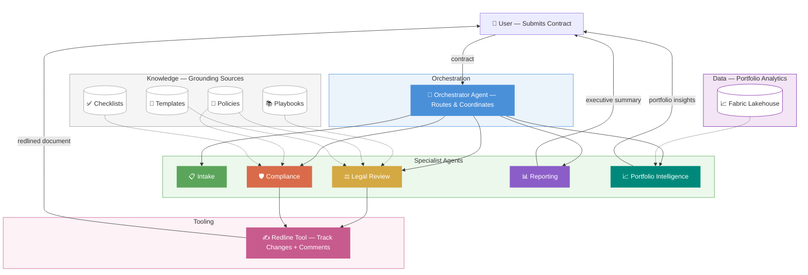

# How We Solved — AI Powered Contracts

**The one where AI agents finally tamed the contract beast.**

---

## The Problem Nobody Wants to Talk About

Here's a fun question: what takes longer — flying across the Atlantic, or getting a contract approved at a large enterprise?

If you guessed the contract, congratulations. You've worked in procurement.

We recently partnered with a large organization that was watching contracts take **4 to 5 months** to move from "someone had an idea" to "someone signed on the dotted line." In the meantime, discounts expired, vendors got antsy, revenue opportunities quietly slipped out the back door, and somewhere a finance team was whispering *"we need to talk about that contract that went dark."*

Going dark. That's actually what they called it. Like contracts were secret agents who'd missed their check-in window.

---

## The Bottlenecks (a.k.a. The Usual Suspects)

When we dug in, the delays weren't where people expected. It wasn't data entry. It wasn't "someone forgot to hit send." The real bottlenecks were:

- **Drafting & Review** — Every contract was a snowflake. Teams manually compared incoming language against corporate playbooks, policies, and "the way we did it last time" (a.k.a. tribal knowledge stored in someone's head who may or may not still work there).
- **Routing & Dispatch** — Nobody was quite sure which contracts needed legal review, which needed tax, which needed cybersecurity, and which needed all of the above. The answer was usually "send it to everyone and hope for the best."
- **No Single Source of Truth** — Contract data lived in at least five different systems. Finding the current version of anything was an archaeological expedition.
- **Staffing Squeeze** — The team had shrunk by roughly 30% while contract volume kept climbing. The math was not mathing.

---

## What Success Looks Like

Before writing a single line of code, we aligned on what "done" actually meant:

| Metric | Before | Target |
|--------|--------|--------|
| Contract cycle time | 4–5 months | ~1 month |
| Risk coverage | Inconsistent, manual | Automated, policy-grounded |
| Contracts "going dark" | Regular occurrence | Near zero |
| Review team utilization | Overwhelmed | Right-sized routing |

The key insight? **Nobody needed a faster human.** They needed to stop asking humans to do things that a well-grounded AI could do at machine speed — while keeping humans firmly in the loop for judgment calls.

---

## The Approach: Agents, Assemble

We built a **multi-agent AI system** where specialized agents each handle one part of the contract lifecycle. Think of it like a pit crew — everyone has a specific job, nobody's trying to change all four tires at once.

### How It Fits Together

### The Lineup

🎯 **The Orchestrator** — The team lead. Understands what the user needs, routes work to the right specialist, and stitches everything together into a coherent response.

📋 **The Intake Specialist** — Classifies contracts by type, assesses urgency, and determines which review teams need to be involved. No more "send it to everyone."

⚖️ **The Legal Reviewer** — Compares contract language against approved playbooks and templates. Flags deviations. Categorizes risk. Suggests approved alternative language. All grounded in actual corporate policy — not vibes.

🛡️ **The Compliance Analyst** — Checks tax obligations, insurance requirements, cybersecurity standards, and regulatory compliance. Produces a traffic-light risk score: green, yellow, or red.

📊 **The Reporter** — Extracts key terms, identifies obligations and deadlines, and generates an executive summary with prioritized recommendations. The "give me the bottom line" agent.

📈 **The Portfolio Intelligence Agent** — Queries a centralized data lakehouse for portfolio-level insights. Benchmarks contracts against the broader portfolio, tracks spend trends, surfaces upcoming renewals, and flags vendor risk. The "how does this compare to everything else we've signed?" agent.

### The Secret Sauce: Grounding

Every agent is **policy-grounded** — meaning it references actual corporate standards, playbooks, and approved templates. No hallucinated legal advice. No "I think the standard clause says something like..." The agents know what good looks like because we told them, with receipts.

### The Cherry on Top: Automated Redlining

We didn't stop at "here's a report." We built a tool that takes the agents' recommendations and **automatically redlines the actual Word document** — tracked changes, rationale comments, the works. Open the document, and it looks exactly like a senior counsel spent an afternoon with it. Except it took about 30 seconds.

---

## The Outcomes

After a rapid prototyping sprint:

✅ **End-to-end contract review in minutes, not months.** From document ingestion through classification, policy comparison, compliance check, and executive summary — fully automated.

✅ **Consistent, auditable results.** Every finding references specific policy sections. Every recommendation comes with rationale. No more "because I said so."

✅ **Right-sized routing.** Contracts go to exactly the teams that need to see them — no more, no less. Tax only sees tax-relevant contracts. Cybersecurity only sees tech vendors. Revolutionary concept, apparently.

✅ **Human-in-the-loop where it matters.** The agents flag and recommend. Humans review, approve, and make the final call. AI handles the heavy lifting; humans handle the judgment.

✅ **Scalable by design.** Adding a new compliance domain? Add a new agent. Updating a policy? Update the knowledge source. Need portfolio-wide insights? The data agent queries the lakehouse. The architecture grows with the business.

---

## The Takeaway

The contract review problem isn't a technology problem — it's a **coordination** problem. Organizations don't need one magical AI that does everything. They need a team of specialized agents, each excellent at one thing, working together in a well-orchestrated pipeline.

We built this using **Microsoft Copilot Studio's multi-agent framework** with knowledge grounding, and a custom Python tool for document redlining. The entire solution is low-code where it should be, pro-code where it needs to be, and AI-powered throughout.

If your contracts are going dark, maybe it's time to bring in some agents who actually check in on time. 🕵️

---

*This is part of the "How We Solved" series — real problems, real solutions, genericized to protect the innocent (and the NDAs).*

*#AI #CopilotStudio #Agents #ContractManagement #Automation #Microsoft #MultiAgent*
