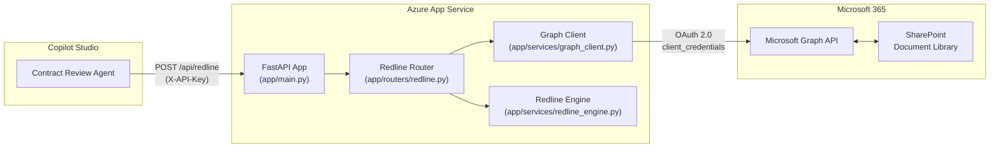
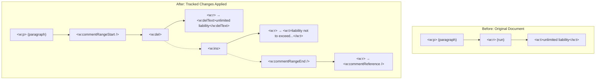
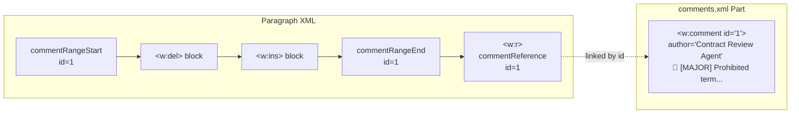
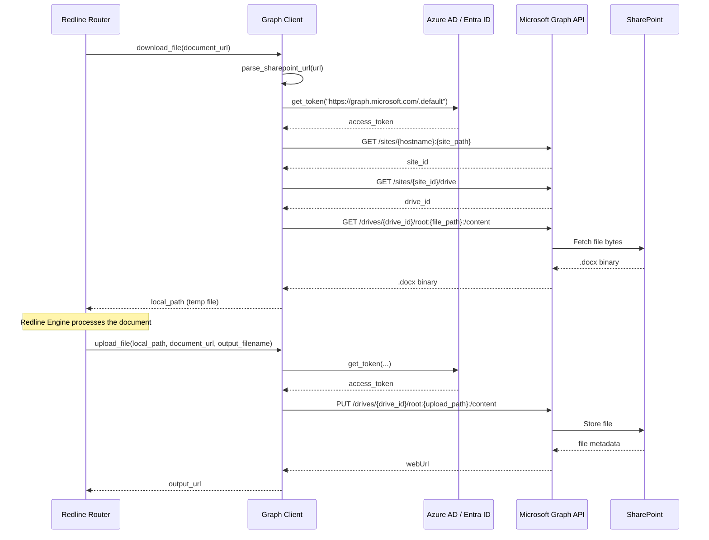
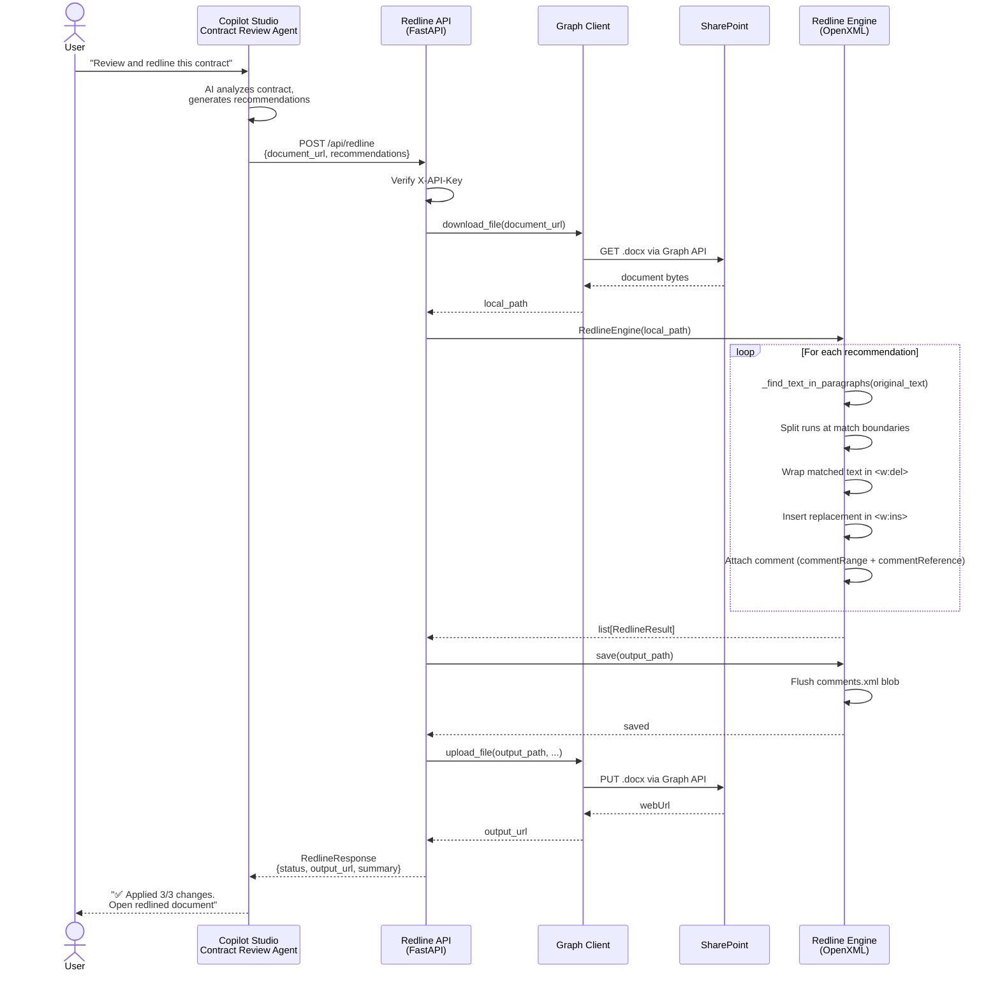

# Contract Redline Tool — Technical Documentation

## 1. Overview

The Contract Redline Tool is a FastAPI microservice that programmatically applies **tracked changes** (insertions and deletions) and **rationale comments** to Word (`.docx`) contracts stored in SharePoint. It is a core component of the **Contract Agent** multi-agent solution, where an AI agent analyzes a contract, produces a list of recommended edits, and this tool materializes those edits into an industry-standard redlined Word document.

Key capabilities:

- Downloads a Word document from SharePoint via Microsoft Graph API.
- Applies OpenXML-level tracked changes (`<w:del>` / `<w:ins>`) so reviewers see changes in Word's native Track Changes UI.
- Attaches Word comments with risk-rated rationale to each change.
- Uploads the redlined document back to SharePoint and returns a shareable URL.

---

## 2. Architecture

### Component Diagram



### Internal Request Flow

1. **Copilot Studio** sends a `POST /api/redline` request with the document URL and a list of recommendations.
2. The **Redline Router** (`app/routers/redline.py`) orchestrates the process.
3. The **Graph Client** (`app/services/graph_client.py`) downloads the `.docx` file from SharePoint.
4. The **Redline Engine** (`app/services/redline_engine.py`) opens the document, applies tracked changes, and adds comments.
5. The **Graph Client** uploads the redlined document back to SharePoint.
6. The router returns a `RedlineResponse` with the SharePoint URL and per-change results.

### Project Structure

```
ContractRedlineTool/
├── app/
│   ├── main.py                  # FastAPI app, CORS, API key auth, health check
│   ├── config.py                # Pydantic Settings (env vars)
│   ├── models/
│   │   └── schemas.py           # Request/response Pydantic models
│   ├── routers/
│   │   └── redline.py           # POST /api/redline endpoint
│   └── services/
│       ├── graph_client.py      # Microsoft Graph API client (download/upload)
│       └── redline_engine.py    # OpenXML tracked changes & comments engine
├── tests/
│   └── conftest.py              # Pytest fixtures (TestClient, sample data)
├── deploy/
│   ├── app-service-config.json  # Azure App Service configuration reference
│   └── bicep/
│       └── main.bicep           # Infrastructure as Code (App Service + Plan)
├── Dockerfile                   # Container image definition
├── startup.sh                   # Azure App Service startup script (gunicorn)
├── requirements.txt             # Python dependencies
└── .env.example                 # Environment variable template
```

---

## 3. API Reference

### `POST /api/redline`

Redlines a SharePoint Word document with tracked changes and rationale comments.

**Authentication:** `X-API-Key` header (validated against the `API_KEY` environment variable).

#### Request Schema (`RedlineRequest`)

| Field              | Type                | Required | Description |
|--------------------|---------------------|----------|-------------|
| `document_url`     | `string`            | Yes      | Full SharePoint URL to the `.docx` file |
| `recommendations`  | `Recommendation[]`  | Yes      | List of changes to apply (min 1) |
| `author`           | `string`            | No       | Author name for tracked changes (default: `Contract Review Agent`) |
| `output_filename`  | `string`            | No       | Output filename; defaults to `{original}_redlined.docx` |

#### Recommendation Schema

| Field              | Type     | Required | Description |
|--------------------|----------|----------|-------------|
| `original_text`    | `string` | Yes      | Exact text in the contract to find and replace |
| `replacement_text` | `string` | No       | New text to insert (empty string = delete only) |
| `rationale`        | `string` | Yes      | Explanation added as a Word comment |
| `risk_level`       | `enum`   | No       | `major`, `moderate`, or `minor` (default: `moderate`) |
| `section`          | `string` | No       | Contract section where this change applies |

#### Request Example

```json
{
  "document_url": "https://contoso.sharepoint.com/sites/contracts/Shared Documents/Vendor-NDA-2025.docx",
  "recommendations": [
    {
      "original_text": "unlimited liability",
      "replacement_text": "liability not to exceed the total contract value",
      "rationale": "Prohibited term per procurement policy §4.2",
      "risk_level": "major",
      "section": "Limitation of Liability"
    },
    {
      "original_text": "shall be governed by the laws of any jurisdiction",
      "replacement_text": "shall be governed by the laws of the applicable jurisdiction",
      "rationale": "Governing law must specify home jurisdiction",
      "risk_level": "moderate",
      "section": "Governing Law"
    },
    {
      "original_text": "perpetual and irrevocable license",
      "replacement_text": "non-exclusive, revocable license for the term of this Agreement",
      "rationale": "IP licenses should be limited in scope and duration",
      "risk_level": "major",
      "section": "Intellectual Property"
    }
  ],
  "author": "Contract Review Agent"
}
```

#### Response Schema (`RedlineResponse`)

| Field             | Type              | Description |
|-------------------|-------------------|-------------|
| `status`          | `string`          | `success`, `partial`, or `error` |
| `output_url`      | `string`          | SharePoint URL to the redlined document |
| `changes_applied` | `int`             | Number of tracked changes successfully applied |
| `changes_failed`  | `int`             | Number of changes that could not be applied |
| `comments_added`  | `int`             | Number of rationale comments added |
| `results`         | `ChangeResult[]`  | Per-change results |
| `summary`         | `string`          | Human-readable summary |
| `error`           | `string`          | Error message (if `status` is `error`) |

#### Response Example

```json
{
  "status": "success",
  "output_url": "https://contoso.sharepoint.com/sites/contracts/Shared Documents/Vendor-NDA-2025_redlined.docx",
  "changes_applied": 3,
  "changes_failed": 0,
  "comments_added": 3,
  "results": [
    {
      "original_text": "unlimited liability",
      "replacement_text": "liability not to exceed the total contract value",
      "applied": true,
      "comment_added": true,
      "error": ""
    },
    {
      "original_text": "shall be governed by the laws of any jurisdiction",
      "replacement_text": "shall be governed by the laws of the applicable jurisdiction",
      "applied": true,
      "comment_added": true,
      "error": ""
    },
    {
      "original_text": "perpetual and irrevocable license",
      "replacement_text": "non-exclusive, revocable license for the term of this Agreement",
      "applied": true,
      "comment_added": true,
      "error": ""
    }
  ],
  "summary": "Applied 3/3 tracked changes with 3 rationale comments. "
}
```

#### Error Responses

| Status | Condition |
|--------|-----------|
| `400`  | Invalid request body or malformed Word document |
| `403`  | Invalid or missing `X-API-Key` |
| `500`  | Internal processing error |
| `502`  | SharePoint communication error (download or upload failed) |

### `GET /health`

Returns the service health status. No authentication required.

```json
{
  "status": "healthy",
  "version": "1.0.0",
  "service": "Contract Redline Tool"
}
```

---

## 4. Redline Engine

The redline engine (`app/services/redline_engine.py`) operates directly on the OpenXML structure inside `.docx` files using `python-docx` and `lxml`. It produces the same XML that Microsoft Word generates when a user makes changes with Track Changes enabled.

### OpenXML Tracked Change Structure

A tracked change replaces original `<w:r>` (run) elements with a `<w:del>` block containing `<w:delText>`, followed by a `<w:ins>` block containing the new `<w:t>` text:



### Comment Attachment Flow

Word comments are attached to text ranges using three linked elements that share the same `comment_id`:



The engine:
1. Creates or locates the `comments.xml` part in the `.docx` package (`_ensure_comments_part`).
2. Adds a `<w:comment>` element with the rationale text, prefixed with a risk emoji (`🔴` major, `🟡` moderate, `🟢` minor).
3. Inserts `commentRangeStart` before the `<w:del>` block and `commentRangeEnd` + `commentReference` after the `<w:ins>` block (or after `<w:del>` if deletion-only).

### Text Search Algorithm

Word frequently splits a single logical string across multiple `<w:r>` (run) elements for formatting reasons. The engine's `_find_text_in_paragraphs` method handles this:

1. **Concatenate** all run texts in each paragraph to reconstruct the full paragraph string.
2. **Build a run-map** — a list of `(run_index, char_start, char_end)` tuples tracking each run's character range.
3. **Slide** through the full text performing case-insensitive substring search.
4. **Map back** each match to the affected runs with overlap offsets `(run_index, overlap_start, overlap_end)`.

When a match spans multiple runs or starts/ends mid-run, the engine **splits runs**:
- Text before the match is extracted into a new run placed before the deletion.
- Text after the match is extracted into a new run placed after the deletion.
- The matched portion is wrapped in `<w:del>` with `<w:delText>`.

This ensures formatting is preserved and only the matched text is marked as deleted.

---

## 5. SharePoint Integration

The Graph Client (`app/services/graph_client.py`) handles all SharePoint file operations through the Microsoft Graph API.

### Authentication

The client supports two credential strategies (determined automatically in `GraphClient.credential`):

| Strategy | When Used | Configuration |
|----------|-----------|---------------|
| `ClientSecretCredential` | `AZURE_CLIENT_SECRET` is set | Local dev or non-Azure hosting |
| `DefaultAzureCredential` | `AZURE_CLIENT_SECRET` is empty | Azure App Service with Managed Identity |

### Graph API Flow



### URL Parsing

`parse_sharepoint_url()` extracts the hostname, site path, and file path from SharePoint URLs. Supported formats:

- `https://contoso.sharepoint.com/sites/mysite/Shared Documents/folder/file.docx`
- `https://contoso-my.sharepoint.com/personal/user/Documents/file.docx`

The regex pattern `^(/(?:sites|personal)/[^/]+)(/.+)$` splits the path into a site path (e.g., `/sites/contracts`) and a file path (e.g., `/Shared Documents/NDA.docx`).

### Performance Optimization

If `SHAREPOINT_SITE_ID` and `SHAREPOINT_DRIVE_ID` are pre-configured, the client skips the two Graph API discovery calls (`GET /sites/...` and `GET /sites/.../drive`), reducing latency by ~200-400ms per request.

---

## 6. Copilot Studio Integration

The Contract Redline Tool is designed to be consumed as a **custom connector action** in Copilot Studio.

### Step 1: OpenAPI Spec

The FastAPI app auto-generates an OpenAPI 3.0 specification:

| URL | Format |
|-----|--------|
| `https://<your-app>.azurewebsites.net/openapi.json` | JSON |
| `https://<your-app>.azurewebsites.net/docs` | Swagger UI |
| `https://<your-app>.azurewebsites.net/redoc` | ReDoc |

### Step 2: API Key Authentication

Configure the custom connector with API Key authentication:

- **Key name:** `X-API-Key`
- **Key location:** Header
- **Value:** The value of the `API_KEY` environment variable on the App Service

### Step 3: Custom Connector Configuration

1. In Copilot Studio, navigate to **Actions** → **Add an action** → **Custom connector**.
2. Import the OpenAPI spec from `https://<your-app>.azurewebsites.net/openapi.json`.
3. Configure authentication as described above.
4. Test the connection.

### Step 4: Topic Flow

A Copilot Studio topic calls this API after the AI agent produces recommendations. Example topic YAML:

```yaml
kind: AdaptiveDialog
modelDescription: Applies redline changes to a contract document in SharePoint.
triggers:
  - kind: OnIntent
    intent: RedlineContract
    triggerQueries:
      - "Redline this contract"
      - "Apply changes to the contract"
      - "Mark up the contract with tracked changes"

actions:
  - kind: SendActivity
    activity: Applying tracked changes to the contract...

  - kind: InvokeConnectorAction
    connectionId: contract-redline-tool
    operationId: redline_document
    input:
      document_url: =Topic.DocumentUrl
      recommendations: =Topic.Recommendations
      author: Contract Review Agent
    output:
      status: Topic.RedlineStatus
      output_url: Topic.RedlinedDocUrl
      summary: Topic.RedlineSummary

  - kind: ConditionGroup
    conditions:
      - condition: =Topic.RedlineStatus = "success" || Topic.RedlineStatus = "partial"
        actions:
          - kind: SendActivity
            activity: |
              ✅ {Topic.RedlineSummary}

              [Open redlined document]({Topic.RedlinedDocUrl})
      - condition: =Topic.RedlineStatus = "error"
        actions:
          - kind: SendActivity
            activity: ❌ Failed to redline the contract. Please try again or contact support.
```

---

## 7. Deployment Guide

### Prerequisites

1. **Azure Subscription** with permissions to create App Service resources.
2. **Microsoft Entra ID App Registration** with the following Graph API **application** permissions:
   - `Sites.ReadWrite.All`
   - `Files.ReadWrite.All`
3. Admin consent granted for the above permissions.
4. The SharePoint site and document library where contracts are stored.

### Option A: Bicep Deployment (Recommended)

The `deploy/bicep/main.bicep` template provisions an App Service Plan (Linux) and App Service with system-assigned managed identity.

```bash
# 1. Create resource group
az group create --name rg-contract-agent --location canadacentral

# 2. Deploy infrastructure
az deployment group create \
  --resource-group rg-contract-agent \
  --template-file deploy/bicep/main.bicep \
  --parameters namePrefix=contract-redline appServiceSku=B1

# 3. Note the outputs
# - appServiceName:             contract-redline-app
# - appServiceUrl:              https://contract-redline-app.azurewebsites.net
# - managedIdentityPrincipalId: <principal-id>

# 4. Deploy application code
az webapp deploy \
  --resource-group rg-contract-agent \
  --name contract-redline-app \
  --src-path .

# 5. Configure environment variables
az webapp config appsettings set \
  --resource-group rg-contract-agent \
  --name contract-redline-app \
  --settings \
    AZURE_TENANT_ID=<your-tenant-id> \
    AZURE_CLIENT_ID=<your-client-id> \
    API_KEY=<your-api-key>
```

### Option B: Docker Deployment

```bash
# Build the image
docker build -t contract-redline-tool .

# Run locally
docker run -p 8000:8000 --env-file .env contract-redline-tool

# Push to Azure Container Registry
az acr build --registry <your-acr> --image contract-redline-tool:latest .

# Configure App Service to use the container
az webapp config container set \
  --resource-group rg-contract-agent \
  --name contract-redline-app \
  --container-image-name <your-acr>.azurecr.io/contract-redline-tool:latest
```

The Dockerfile uses Python 3.11-slim, runs on port 8000 with 4 uvicorn workers, and includes a health check against `/health`.

### Option C: Direct App Service Deployment

```bash
# Deploy code directly (uses Oryx build)
az webapp up \
  --resource-group rg-contract-agent \
  --name contract-redline-app \
  --runtime "PYTHON:3.11" \
  --sku B1

# Set startup command
az webapp config set \
  --resource-group rg-contract-agent \
  --name contract-redline-app \
  --startup-file startup.sh
```

The `startup.sh` script runs gunicorn with uvicorn workers, binding to port 8000 with a 120-second timeout.

### Environment Variable Configuration

Set these in Azure App Service → **Configuration** → **Application settings**, or via the CLI:

| Variable | Required | Source | Description |
|----------|----------|--------|-------------|
| `AZURE_TENANT_ID` | Yes | Entra ID | Tenant ID |
| `AZURE_CLIENT_ID` | Yes | App Registration | Client ID with Graph permissions |
| `AZURE_CLIENT_SECRET` | No* | App Registration | Client secret (omit for Managed Identity) |
| `SHAREPOINT_SITE_ID` | No | Graph API | Pre-resolved site ID (optimization) |
| `SHAREPOINT_DRIVE_ID` | No | Graph API | Pre-resolved drive ID (optimization) |
| `API_KEY` | Yes | You generate | Key for Copilot Studio authentication |
| `WEBSITES_PORT` | Yes | Fixed: `8000` | App Service port mapping |
| `SCM_DO_BUILD_DURING_DEPLOYMENT` | Yes | Fixed: `true` | Enables pip install during deploy |

\* Use `AZURE_CLIENT_SECRET` for local development. In production, use Managed Identity instead.

### Managed Identity Setup

1. The Bicep template enables system-assigned managed identity automatically.
2. Grant the managed identity Graph API permissions:

```bash
# Get the managed identity principal ID (from Bicep output or Azure Portal)
PRINCIPAL_ID=<from-bicep-output>

# Grant Sites.ReadWrite.All and Files.ReadWrite.All
# (Requires Global Admin or Privileged Role Administrator)
az ad app permission grant \
  --id $PRINCIPAL_ID \
  --api 00000003-0000-0000-c000-000000000000 \
  --scope Sites.ReadWrite.All Files.ReadWrite.All
```

3. Remove `AZURE_CLIENT_SECRET` from App Settings — the `DefaultAzureCredential` in `graph_client.py` will automatically use the managed identity.

---

## 8. End-to-End Flow



---

## 9. Testing

### Running Tests

```bash
cd ContractRedlineTool
pytest tests/ -v
```

### Test Fixtures

The `tests/conftest.py` provides shared fixtures:

- **`client`** — a `FastAPI.TestClient` instance for the app.
- **`sample_recommendation`** — a single recommendation dict with realistic contract text.
- **`sample_request`** — a full `RedlineRequest` payload with a SharePoint URL and one recommendation.

### Testing Locally Without SharePoint

To test the redline engine in isolation (without Graph API calls):

```python
from app.services.redline_engine import RedlineEngine

engine = RedlineEngine("path/to/test.docx")
results = engine.apply_all_changes([
    {
        "original_text": "unlimited liability",
        "replacement_text": "limited liability",
        "rationale": "Policy violation",
        "risk_level": "major",
    }
])
engine.save("output.docx")
```

### Testing the API

```bash
# Health check
curl http://localhost:8000/health

# Redline request (requires Graph API credentials)
curl -X POST http://localhost:8000/api/redline \
  -H "Content-Type: application/json" \
  -H "X-API-Key: your-api-key" \
  -d '{
    "document_url": "https://contoso.sharepoint.com/sites/contracts/Shared Documents/test.docx",
    "recommendations": [{
      "original_text": "unlimited liability",
      "replacement_text": "limited liability",
      "rationale": "Policy violation",
      "risk_level": "major"
    }]
  }'
```

---

## 10. Security Considerations

### API Key Authentication

- All `/api/*` routes are protected by the `X-API-Key` header, validated against the `API_KEY` environment variable in `app/main.py`.
- If `API_KEY` is empty, authentication is effectively disabled (useful for local dev only).
- Store the API key in **Azure Key Vault** and reference it from App Service settings.

### Managed Identity (Production)

- Use system-assigned managed identity (`DefaultAzureCredential`) instead of client secrets in production.
- The Bicep template (`deploy/bicep/main.bicep`) enables managed identity by default.
- Remove `AZURE_CLIENT_SECRET` from App Settings once managed identity is configured.

### HTTPS & TLS

- The Bicep template sets `httpsOnly: true` and `minTlsVersion: '1.2'`.
- FTP is disabled (`ftpsState: 'Disabled'`).
- The `deploy/app-service-config.json` reference confirms these settings.

### CORS

- The FastAPI app currently allows all origins (`allow_origins=["*"]`) for development flexibility.
- In production, restrict CORS to Copilot Studio domains:
  - `https://*.powerapps.com`
  - `https://*.dynamics.com`
- This is documented in `deploy/app-service-config.json` under `networking.cors`.

### Graph API Permissions

The app requires these **application** (not delegated) permissions:

| Permission | Purpose |
|------------|---------|
| `Sites.ReadWrite.All` | Read/write files in SharePoint sites |
| `Files.ReadWrite.All` | Read/write files in OneDrive/SharePoint drives |

These are broad permissions. In production, consider using `Sites.Selected` with site-specific grants for least-privilege access.

### Temporary Files

- The engine writes downloaded and processed `.docx` files to `TEMP_DIR` (default `/tmp/redline`).
- Files are cleaned up in the `finally` block of the redline endpoint (`app/routers/redline.py`, line 143-147).
- On Azure App Service, `/tmp` is ephemeral and not shared across instances.

### Input Validation

- Pydantic models (`app/models/schemas.py`) enforce:
  - `original_text` minimum length of 1 character.
  - `rationale` minimum length of 1 character.
  - `recommendations` list minimum length of 1.
  - `risk_level` restricted to enum values: `major`, `moderate`, `minor`.
