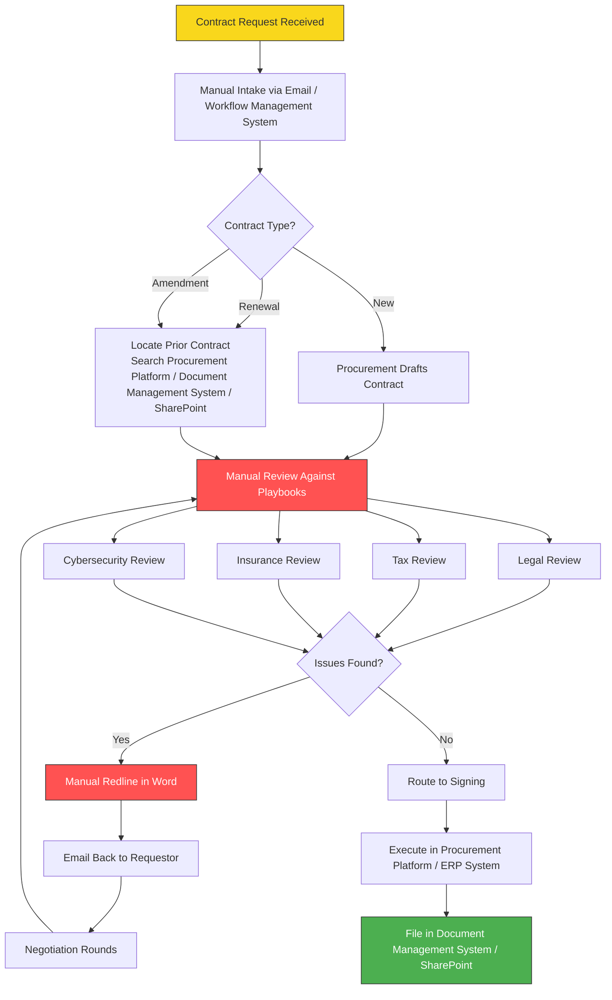
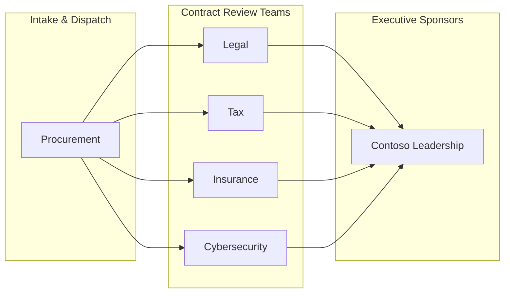
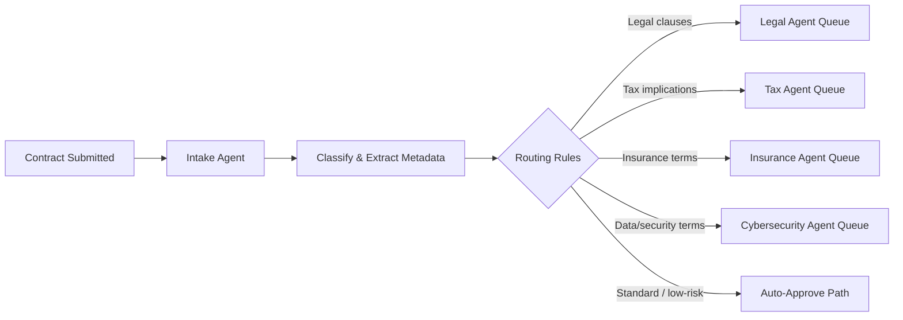
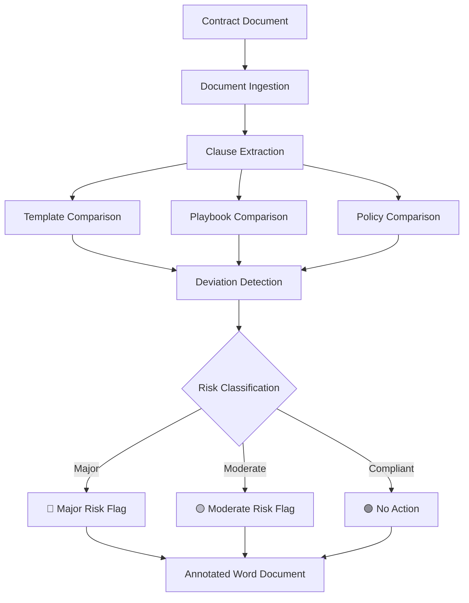
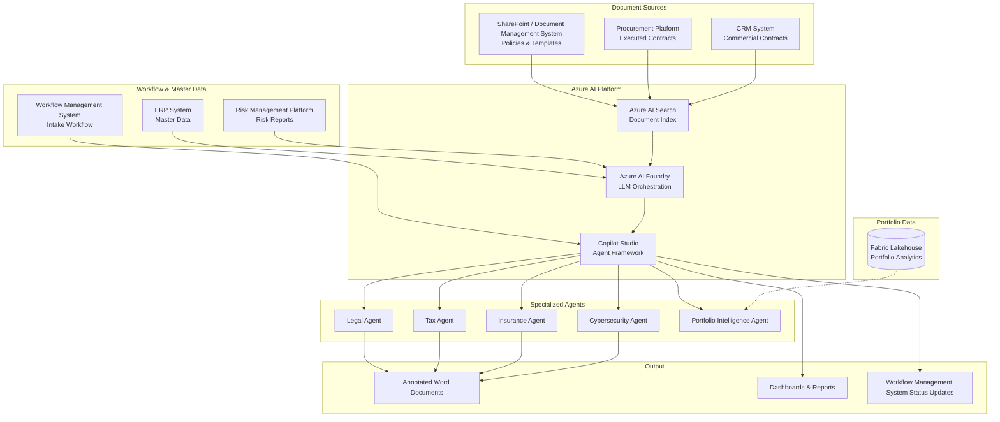
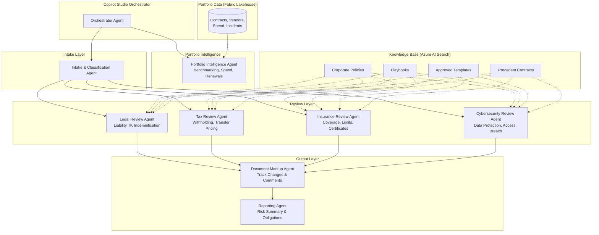
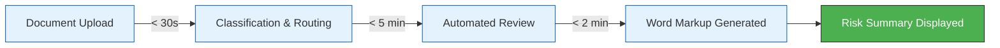
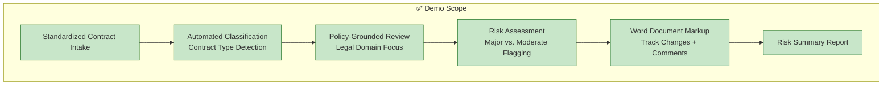
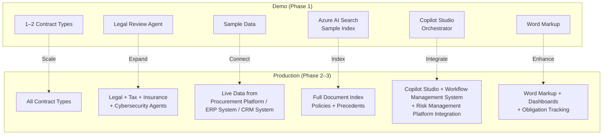
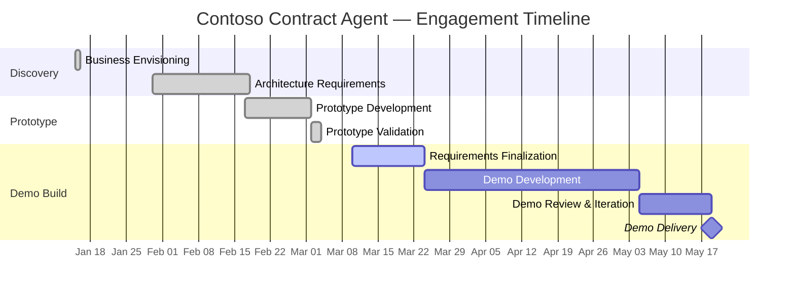

# Contoso Contract Management Automation — Requirements Document

> **Project:** Contract Agent — Copilot Studio Demo  
> **Version:** 1.0  
> **Date:** June 2026  
> **Status:** Draft  
> **Audience:** Microsoft & Contoso project stakeholders

---

## Table of Contents

1. [Executive Summary](#1-executive-summary)
2. [Business Context](#2-business-context)
3. [Stakeholders](#3-stakeholders)
4. [Functional Requirements](#4-functional-requirements)
5. [Non-Functional Requirements](#5-non-functional-requirements)
6. [Data Sources & Integration](#6-data-sources--integration)
7. [Success Criteria](#7-success-criteria)
8. [Constraints & Assumptions](#8-constraints--assumptions)
9. [Demo Scope](#9-demo-scope)

---

## 1. Executive Summary

### Problem Statement

Contoso's contract lifecycle currently spans **4–5 months** from initiation to execution. Contracts are managed across disconnected systems — Procurement Platform, ERP System, CRM System, Document Management System, and SharePoint — with no single source of truth. Review processes depend heavily on manual comparison against playbooks, corporate policies, and precedent contracts, performed by a workforce that has experienced **~30% attrition** in procurement while contract volume continues to grow.

This extended cycle time creates material business risk: contracts "go dark" with expired discount terms, lost revenue opportunities, and delayed vendor payments. The bottlenecks are concentrated in **drafting, review, and dispatch** — not simple data entry — making them ideal candidates for AI-assisted automation.

### Proposed Solution

Deploy a **multi-agent contract management system** built on **Microsoft Copilot Studio** and **Azure AI Foundry** that automates:

- **Intake & triage** — Standardized contract intake with intelligent routing to legal, tax, insurance, and cybersecurity review teams
- **Automated review** — Policy-grounded analysis of contract clauses against approved templates and corporate playbooks
- **Risk assessment** — Flagging of major and moderate deviations with rationale
- **Document markup** — Annotated Word documents with track changes and explanatory comments
- **Reporting** — Extraction of obligations, amendments, and contract history for dashboards

The initial **Copilot Studio demo** will validate the end-to-end agentic pipeline — from document ingestion through classification, policy comparison, and Word markup — using anonymized sample data.

---

## 2. Business Context

### Current State Pain Points

| Pain Point | Impact | Severity |
|---|---|---|
| 4–5 month contract cycle time | Expired discounts, lost revenue, vendor payment delays | **Critical** |
| No single source of truth | Contracts fragmented across 5+ systems | **High** |
| Manual playbook/policy review | Bottleneck at drafting, review, and dispatch stages | **Critical** |
| ~30% procurement staff attrition | Reduced capacity against growing volume | **High** |
| Tribal knowledge dependency | Inconsistent review quality, onboarding delays | **High** |
| Contracts "going dark" | Untracked expirations and missed obligations | **Critical** |

### Current Manual Process

### Key Observations from Discovery

- **Drafting, review, and dispatch** are the primary bottlenecks — not data entry
- Review teams manually compare incoming contract language against corporate standards, playbooks, and prior executed contracts
- No automated mechanism to flag deviations or risk levels
- Reviewers across domains (legal, tax, insurance, cybersecurity) work in silos with limited visibility into each other's progress
- The prototype validation (March 2026) confirmed the viability of an end-to-end agentic review pipeline with Word-embedded markup

---

## 3. Stakeholders

### Contoso

| Name | Role | Responsibility |
|---|---|---|
| Olivia Urban | Procurement Lead | Business requirements, process validation, user acceptance |
| Laila Nouasri | Legal/Procurement | Legal review workflow, policy/playbook definitions |
| Rina Taddei | Procurement/Legal | Contract standards, template management, compliance |

### Microsoft

| Role | Responsibility |
|---|---|
| Solution Architect | System design, Azure AI Foundry + Copilot Studio architecture |
| Technical Lead | Agent development, integration, demo delivery |
| Project Manager | Timeline, stakeholder coordination, deliverables |

### Review Domains

---

## 4. Functional Requirements

### 4.1 — Standardized Intake & Dispatch

> **Use Case 1:** Triage incoming contracts to the appropriate review teams (legal, tax, insurance, cybersecurity) based on contract type, value, and content.

| ID | Requirement | Priority |
|---|---|---|
| FR-1.1 | Accept contract submissions via standardized intake form (replacing ad-hoc email) | **Must** |
| FR-1.2 | Automatically classify contract type (new, renewal, amendment, SOW, NDA, MSA) | **Must** |
| FR-1.3 | Extract key metadata: parties, effective dates, value, governing law, contract category | **Must** |
| FR-1.4 | Route contracts to required review queues based on classification rules (legal, tax, insurance, cybersecurity) | **Must** |
| FR-1.5 | Integrate with Workflow Management System for intake workflow tracking and status updates | **Should** |
| FR-1.6 | Provide a dashboard view of intake queue, status, and SLA tracking | **Should** |
| FR-1.7 | Support bulk upload of contracts for batch processing | **Could** |

### 4.2 — Automated Contract Review & Risk Assessment

> **Use Case 2:** Compare incoming contract language against approved templates, corporate playbooks, and policies to identify deviations and assess risk.

| ID | Requirement | Priority |
|---|---|---|
| FR-2.1 | Compare incoming contract clauses against approved templates for the relevant contract type | **Must** |
| FR-2.2 | Compare contract terms against corporate playbook standards (e.g., liability caps, indemnification, IP, termination) | **Must** |
| FR-2.3 | Classify identified deviations as **Major Risk** or **Moderate Risk** based on policy thresholds | **Must** |
| FR-2.4 | Provide rationale for each flagged deviation, citing the specific policy or template clause | **Must** |
| FR-2.5 | Support domain-specific review: separate specialized agents for legal, tax, insurance, and cybersecurity | **Must** |
| FR-2.6 | All review decisions must be **policy-grounded** — no reliance on tribal knowledge or uncodified heuristics | **Must** |
| FR-2.7 | Compare against prior executed contracts for the same vendor/category to identify precedent | **Should** |
| FR-2.8 | Generate a consolidated risk summary across all review domains | **Should** |

### 4.3 — Document Markup & Track Changes

> **Use Case 3:** Produce annotated Word documents with track changes, comments, and rationale for each flagged issue.

| ID | Requirement | Priority |
|---|---|---|
| FR-3.1 | Generate Word documents with track-change markup for recommended modifications | **Must** |
| FR-3.2 | Insert comments at each flagged clause with risk level, rationale, and policy reference | **Must** |
| FR-3.3 | Preserve original document formatting and structure | **Must** |
| FR-3.4 | Support iterative review — accept/reject changes and re-run analysis on updated document | **Should** |
| FR-3.5 | Provide suggested alternative language from approved templates where deviations are found | **Should** |

### 4.4 — Information Extraction & Reporting

> **Use Case 4:** Extract obligations, amendments, and contract history for reporting and compliance tracking.

| ID | Requirement | Priority |
|---|---|---|
| FR-4.1 | Extract key obligations (payment terms, milestones, SLAs, renewal dates, termination clauses) | **Must** |
| FR-4.2 | Track amendment history for a given contract, linking amendments to the parent agreement | **Should** |
| FR-4.3 | Generate summary reports of contract portfolio risk exposure by domain | **Should** |
| FR-4.4 | Provide exportable data for integration with BI/reporting tools | **Could** |
| FR-4.5 | Support natural-language queries against the contract corpus (e.g., "Which contracts have unlimited liability?") | **Could** |

### 4.5 — Quality Control & Checklist Validation

> **Use Case 5:** Validate contracts against mandatory checklists before dispatch and execution.

| ID | Requirement | Priority |
|---|---|---|
| FR-5.1 | Validate contract against a configurable pre-dispatch checklist (signatures, required clauses, attachments) | **Must** |
| FR-5.2 | Block dispatch if mandatory checklist items are incomplete | **Must** |
| FR-5.3 | Generate a compliance certificate/report upon passing all checklist items | **Should** |
| FR-5.4 | Support domain-specific checklists (legal, tax, insurance, cybersecurity) | **Should** |

### 4.6 — Portfolio Intelligence & Data-Driven Benchmarking

> **Use Case 6:** Provide portfolio-level intelligence — benchmarking, spend analytics, renewal tracking, and vendor risk assessment — powered by data from a centralized lakehouse.

| ID | Requirement | Priority |
|---|---|---|
| FR-6.1 | Benchmark a contract's terms (value, duration, risk level) against the broader portfolio to identify outliers | **Should** |
| FR-6.2 | Aggregate and visualize spend data by vendor, category, and time period with trend analysis | **Should** |
| FR-6.3 | Surface upcoming contract renewals and expirations with configurable alert thresholds (e.g., 180-day, 90-day, 30-day) | **Must** |
| FR-6.4 | Provide vendor risk profiles based on historical compliance incidents and performance data | **Should** |
| FR-6.5 | Support natural-language queries against portfolio data (e.g., "How does this contract compare to similar vendors?", "What's our total spend with this vendor?") | **Should** |
| FR-6.6 | Data source must be a centralized data platform (e.g., Microsoft Fabric lakehouse) with tables for contracts, clauses, vendors, compliance incidents, and spend actuals | **Must** |

---

## 5. Non-Functional Requirements

### 5.1 — Security & Compliance

| ID | Requirement | Priority |
|---|---|---|
| NFR-1.1 | All data must remain within Contoso's Azure tenant and comply with domestic data residency requirements | **Must** |
| NFR-1.2 | Support private endpoint access to Azure resources (no public internet exposure) | **Must** |
| NFR-1.3 | Role-based access control (RBAC) for agents, review queues, and reporting | **Must** |
| NFR-1.4 | Audit trail for all agent actions, recommendations, and user decisions | **Must** |
| NFR-1.5 | Data encryption at rest and in transit | **Must** |
| NFR-1.6 | No contract data used for model training or shared outside the tenant | **Must** |

### 5.2 — Performance

| ID | Requirement | Priority |
|---|---|---|
| NFR-2.1 | Contract classification and routing: < 30 seconds per document | **Must** |
| NFR-2.2 | Full automated review (single domain): < 5 minutes per document | **Should** |
| NFR-2.3 | Word markup generation: < 2 minutes per document | **Should** |
| NFR-2.4 | Support concurrent processing of at least 10 contracts | **Should** |

### 5.3 — Scalability & Availability

| ID | Requirement | Priority |
|---|---|---|
| NFR-3.1 | Horizontally scalable agent architecture to handle volume growth | **Should** |
| NFR-3.2 | 99.5% availability during business hours (ET) for production deployment | **Could** |
| NFR-3.3 | Graceful degradation if a specialized agent is unavailable (queue, not fail) | **Should** |

### 5.4 — Governance & Explainability

| ID | Requirement | Priority |
|---|---|---|
| NFR-4.1 | All agent recommendations must cite specific policy/template references (no opaque outputs) | **Must** |
| NFR-4.2 | Human-in-the-loop approval required before any contract is dispatched or executed | **Must** |
| NFR-4.3 | Configurable risk thresholds and classification rules (not hardcoded) | **Should** |
| NFR-4.4 | Version-controlled policy and template corpus with change tracking | **Should** |

---

## 6. Data Sources & Integration

### System Landscape

| System | Role | Data Types | Integration |
|---|---|---|---|
| **SharePoint / Document Management System** | Policy & template repository | Playbooks, approved templates, corporate policies | Azure AI Search / Graph API |
| **Procurement Platform** | Procurement & contract execution | Executed contracts, vendor master, procurement records | API / data export |
| **CRM System** | Commercial contracts | Customer agreements, sales contracts | API |
| **Workflow Management System** | Intake workflow | Contract requests, status tracking, assignments | REST API / webhook |
| **ERP System** | Master data | Vendor master, cost centers, organizational data | OData / RFC |
| **Risk Management Platform** | Risk management | Risk reports, compliance assessments | API / data export |
| **Microsoft Word** | Document authoring | Contracts (input), annotated contracts (output) | Open XML SDK / Graph API |
| **Microsoft Fabric** | Portfolio data platform | Contracts, vendor data, spend actuals, compliance incidents | Fabric Data Agent / lakehouse connector |

### Integration Architecture

### Multi-Agent Architecture

---

## 7. Success Criteria

### Primary KPIs

| KPI | Current State | Target (Demo) | Target (Production) |
|---|---|---|---|
| Contract cycle time | 4–5 months | Demonstrate 50%+ reduction in review phase | Reduce to < 2 months end-to-end |
| Risk coverage | Manual, inconsistent | 100% of clauses checked against policy in demo | 100% policy-grounded review on all contracts |
| Time to first review feedback | Days–weeks | < 15 minutes for automated first pass | < 30 minutes per contract |
| Review consistency | Varies by reviewer | Deterministic, policy-grounded output | > 95% consistency across runs |
| Reviewer capacity | ~30% understaffed | Demonstrate capacity multiplier | 3× throughput per reviewer |

### Secondary KPIs

| KPI | Target |
|---|---|
| Intake-to-routing time | < 1 minute (automated classification + dispatch) |
| Policy citation accuracy | > 90% of flagged issues cite correct policy reference |
| False positive rate | < 20% of flagged items are non-issues |
| User satisfaction (reviewers) | > 4/5 on usefulness survey |
| Checklist compliance rate | 100% of dispatched contracts pass mandatory checklist |

### Demo-Specific Success Criteria

- [ ] End-to-end pipeline executes without manual intervention
- [ ] At least 2 contract types processed (e.g., MSA, SOW)
- [ ] Major and moderate risks correctly identified against sample playbook
- [ ] Word document produced with accurate track changes and comments
- [ ] Policy citations are traceable to source documents

---

## 8. Constraints & Assumptions

### Known Constraints

| ID | Constraint | Impact | Mitigation |
|---|---|---|---|
| C-1 | **Procurement policy gaps** — some policy documents are incomplete or missing | Agents cannot review against non-existent policies | Identify gaps early; use available policies for demo; flag gaps for Contoso to remediate |
| C-2 | **Network / private endpoint access** — Contoso requires private endpoints to Azure resources | Adds networking complexity; may delay integration testing | Coordinate with Contoso IT early; use service endpoints where possible |
| C-3 | **Anonymized / sample data required** — real contracts cannot be used in shared dev environments | Limits fidelity of testing | Create realistic synthetic contracts based on structure of real ones |
| C-4 | **Multi-system data fragmentation** — no unified contract data model exists today | Integration requires mapping and normalization | Define canonical contract schema for the agent layer |
| C-5 | **Word document complexity** — real contracts vary widely in formatting and structure | Markup agent must handle diverse document layouts | Test against representative sample set; graceful fallback for unsupported formats |

### Assumptions

| ID | Assumption | Risk if Invalid |
|---|---|---|
| A-1 | Contoso will provide sample/anonymized contracts and playbooks for prototyping | Demo cannot proceed without representative data |
| A-2 | Corporate playbooks and policies can be digitized and indexed in Azure AI Search | Review agents cannot function without searchable policy corpus |
| A-3 | Workflow Management System intake workflow is accessible via API and can be integrated for routing | Intake automation will require alternative trigger mechanism |
| A-4 | Copilot Studio + Azure AI Foundry can meet latency requirements for interactive review | May need to optimize chunking, caching, or pre-processing |
| A-5 | Human reviewers will remain in the loop for all final decisions (agent = assistant, not decision-maker) | Governance and liability model would need to change |
| A-6 | Existing Word document templates follow a reasonably consistent structure | Markup quality may degrade on highly non-standard documents |

---

## 9. Demo Scope

### In Scope (Copilot Studio Demo)

| Area | Demo Deliverable |
|---|---|
| **Intake** | Upload contract → automatic classification (type, parties, key dates) |
| **Routing** | Rule-based dispatch to appropriate review queue |
| **Review** | Legal-domain review against sample playbook and template |
| **Risk flagging** | Major / Moderate risk classification with rationale |
| **Markup** | Annotated Word document with track changes and comments |
| **Reporting** | Summary risk dashboard for demo contracts |
| **Agent architecture** | Orchestrator + at least 1 specialized domain agent (Legal) |
| **Knowledge base** | Sample policies and templates indexed in Azure AI Search |

### Out of Scope (Production Roadmap)

| Area | Reason | Production Phase |
|---|---|---|
| Full multi-domain agents (Tax, Insurance, Cybersecurity) | Requires domain-specific policies and SME validation | Phase 2 |
| Procurement Platform / ERP System live integration | Requires private endpoint networking and data access | Phase 2 |
| CRM System integration | Requires API setup and data mapping | Phase 2–3 |
| Risk Management Platform risk report integration | Requires API access and risk model alignment | Phase 3 |
| Bulk contract migration / backlog processing | Requires production-grade throughput and error handling | Phase 3 |
| Full Workflow Management System workflow integration | Demo uses simplified intake; production needs full workflow | Phase 2 |
| Multi-language contract support | Contoso operates in English and French | Phase 3 |
| Production SLAs and high availability | Demo environment only | Phase 3 |
| User training and change management | Follows after production deployment | Phase 3 |

### Demo vs. Production Comparison

---

## Appendix A: Glossary

| Term | Definition |
|---|---|
| **Agent** | An AI-powered component in Copilot Studio that performs a specific task autonomously within defined guardrails |
| **Playbook** | Contoso's internal standard for contract terms in a given category (e.g., acceptable liability caps, required indemnification language) |
| **Policy** | Corporate governance documents that define rules and constraints for contracting |
| **Template** | An approved contract document structure with standard clauses, used as the baseline for comparison |
| **Track Changes** | Microsoft Word revision markup showing insertions, deletions, and comments |
| **Going Dark** | A contract that has expired, lapsed, or lost favorable terms due to processing delays |
| **Major Risk** | A contract deviation that violates a mandatory corporate policy or exceeds defined risk thresholds |
| **Moderate Risk** | A contract deviation that departs from preferred terms but does not violate mandatory policy |

## Appendix B: Engagement Timeline

---

*Document prepared for the Contoso Contract Management Automation project. For questions, contact the Microsoft project team.*
