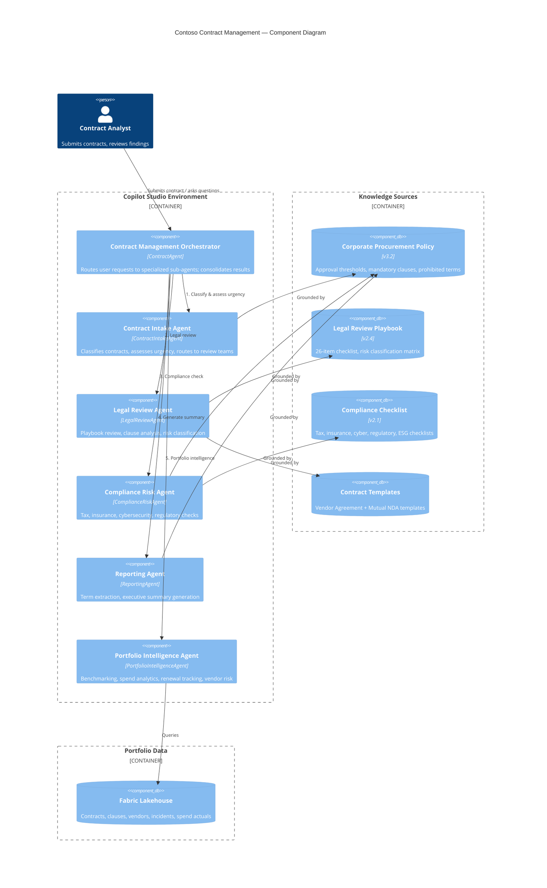
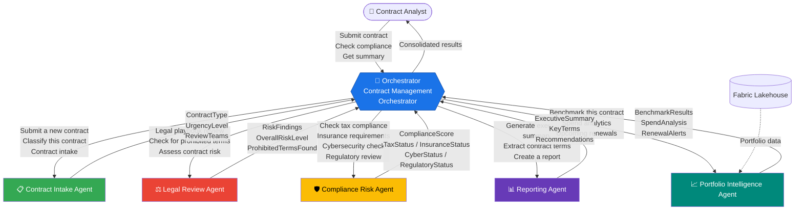
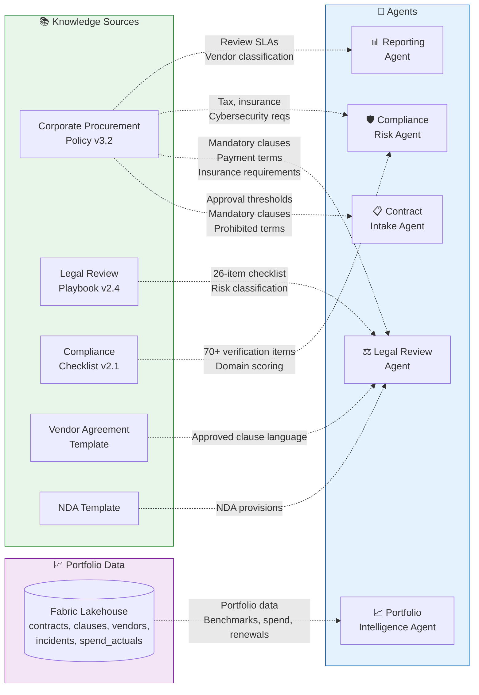
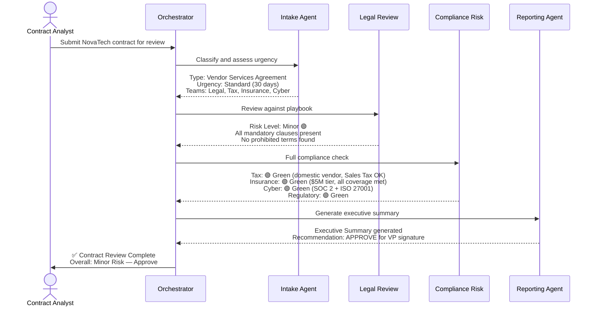
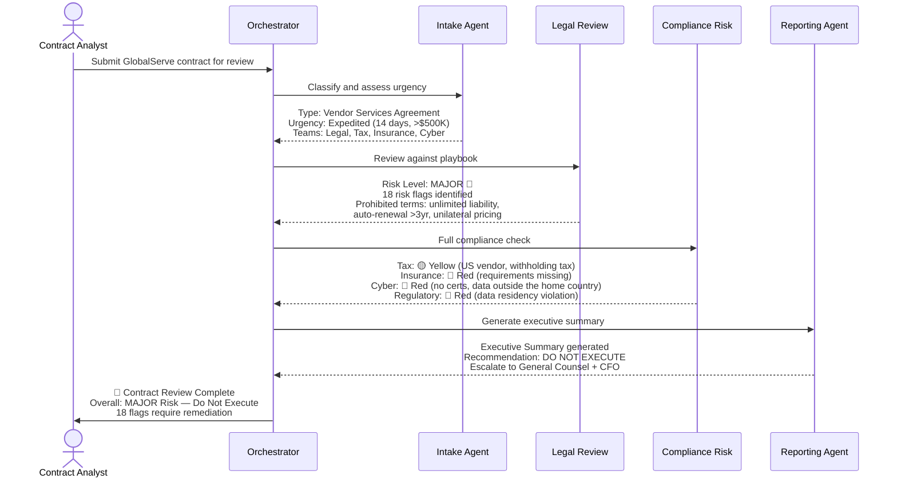

# Contoso Contract Management — Solution Document

> **Version:** 1.0 &nbsp;|&nbsp; **Date:** June 2026 &nbsp;|&nbsp; **Platform:** Microsoft Copilot Studio  
> **Schema:** `cr57c_agentqf4ruA` &nbsp;|&nbsp; **Files:** 40 YAML + 12 documentation &nbsp;|&nbsp; **Status:** Demo-ready

---

## Table of Contents

1. [Solution Overview](#1-solution-overview)
2. [Architecture Summary](#2-architecture-summary)
3. [Agent Inventory](#3-agent-inventory)
4. [Topic Reference](#4-topic-reference)
5. [Sub-Agent Routing](#5-sub-agent-routing)
6. [Knowledge & Grounding](#6-knowledge--grounding)
7. [Demo Walkthrough](#7-demo-walkthrough)
8. [Test Scenarios](#8-test-scenarios)
9. [Deployment Guide](#9-deployment-guide)
10. [Validation & Fixes Applied](#10-validation--fixes-applied)
11. [Project Structure](#11-project-structure)
12. [Next Steps](#12-next-steps)

---

## 1. Solution Overview

### Problem Statement

Contoso's contract review process averages **4–5 months** end-to-end. Manual reviews span fragmented systems (SharePoint, Procurement Platform, CRM System, Document Management System), with no single source of truth. Procurement teams experience 30% attrition, expired discounts go unnoticed, and playbook adherence is inconsistent across legal, tax, insurance, and cybersecurity domains.

### What Was Built

A **multi-agent Copilot Studio solution** that automates contract intake, legal review, compliance assessment, executive reporting, and portfolio-level intelligence for Contoso. The system uses a hub-and-spoke connected-agents pattern where a central orchestrator coordinates five specialized sub-agents, each grounded in Contoso's corporate policies, legal playbooks, compliance checklists, and portfolio data.

### Who It's For

| Audience | How They Use It |
|----------|-----------------|
| **Procurement analysts** | Submit contracts, get instant classification and risk assessment |
| **Legal counsel** | Review flagged clauses against the corporate playbook |
| **Compliance officers** | Verify tax, insurance, cybersecurity, and regulatory requirements |
| **VP / C-suite executives** | Read executive summaries with go/no-go recommendations |
| **Demo stakeholders** | Olivia Urban, Laila Nouasri, Rina Taddei (Contoso procurement leads) |

### Key Capabilities

- **Contract classification** into 5 types with urgency tiering (Standard / Expedited / Critical)
- **Clause-by-clause legal review** against a 26-item playbook with 3-tier risk classification
- **Multi-domain compliance checks** covering tax, insurance, cybersecurity, and regulatory requirements
- **Executive summary generation** with traffic-light risk indicators (🔴🟡🟢) and Must Fix / Should Fix / Consider recommendations
- **Policy-grounded decisions** — all outputs cite specific policy sections; no general model knowledge used for contract guidance
- **Portfolio intelligence** — data-driven benchmarking, spend analytics, and renewal tracking via Microsoft Fabric lakehouse

---

## 2. Architecture Summary



### Design Principles

| Principle | Implementation |
|-----------|---------------|
| **Policy-grounded** | Every agent instruction references specific policy sections; `SearchAndSummarizeContent` queries corpus |
| **Single responsibility** | Each sub-agent owns one domain (intake, legal, compliance, reporting, portfolio intelligence) |
| **Human-in-the-loop** | Major risks escalate to VP Legal / General Counsel; no auto-approvals |
| **Composability** | Agents are independently deployable and testable via connected-agents pattern |
| **Deterministic routing** | Orchestrator uses explicit routing rules, not open-ended delegation |

---

## 3. Agent Inventory

| Agent | Schema Name | Role | Custom Topics | System Topics | Key Capabilities |
|-------|-------------|------|:---:|:---:|------------------|
| **Contract Management Orchestrator** | `cr57c_agentqf4ruA` | Routes to sub-agents, consolidates results | 0 | 13 | Connected agents, generative AI recognizer, semantic search |
| **Contract Intake Agent** | `cr57c_contractIntakeBot` | Classifies contracts, assesses urgency | 2 | 1 | 5 contract types, 3 urgency tiers, review team routing |
| **Legal Review Agent** | `cr57c_legalReviewBot` | Playbook review, risk assessment | 2 | 1 | SearchAndSummarizeContent, 26-item checklist, prohibited terms |
| **Compliance Risk Agent** | `cr57c_complianceRiskBot` | Tax, insurance, cyber, regulatory checks | 3 | 1 | 4 compliance domains, conditional logic, traffic-light scoring |
| **Reporting Agent** | `cr57c_reportingBot` | Term extraction, executive summary | 2 | 1 | SearchAndSummarizeContent, 5-section exec summary, recommendations |
| **Portfolio Intelligence Agent** | `cr57c_portfolioIntelligenceBot` | Benchmarking, spend analytics, renewal tracking | 3 | 1 | Fabric Data Agent, lakehouse queries, vendor risk profiling |

**Total: 6 agents, 12 custom topics, 17 system/conversation topics, 40+ YAML files**

### Agent Settings (Common Configuration)

All sub-agents share these settings:

| Setting | Value |
|---------|-------|
| Authentication | Integrated (Always) |
| Access Control | GroupMembership |
| Generative Actions | Enabled |
| Agent Connectable | True |
| Semantic Search | Enabled |
| File Analysis | Enabled |
| Recognizer | GenerativeAIRecognizer |
| Template | default-2.1.0 |
| Language | 1033 (English) |

---

## 4. Topic Reference

### Custom Topics

| Topic | Agent | Trigger Type | Purpose | Key Features |
|-------|-------|-------------|---------|--------------|
| **Contract Classification** | Intake | OnRecognizedIntent (10 phrases) | Classifies contracts into 5 types, collects metadata | 6 Questions, ConditionGroup for review team routing, SetVariable |
| **Urgency Assessment** | Intake | OnRecognizedIntent (10 phrases) | Determines Standard / Expedited / Critical urgency | 4 Questions, ConditionGroup with $500K/$5M thresholds, 3 SetVariable outputs |
| **Playbook Review** | Legal | OnRecognizedIntent (10 phrases) | Reviews clauses against legal playbook and templates | SearchAndSummarizeContent, ConditionGroup (result/fallback), escalation matrix |
| **Risk Assessment** | Legal | OnRecognizedIntent (10 phrases) | Flags prohibited terms, classifies risk levels | SearchAndSummarizeContent, ConditionGroup, Major/Moderate/Minor with SLAs |
| **Tax Compliance** | Compliance | OnRecognizedIntent (10 phrases) | domestic and international tax verification | 4 Questions, 2 ConditionGroups (vendor location + related-party), Sales Tax logic |
| **Insurance & Cybersecurity** | Compliance | OnRecognizedIntent (10 phrases) | Insurance tier checks + cybersecurity cert validation | 4 Questions, 2 ConditionGroups (value tiers + data sensitivity), PCI DSS logic |
| **Regulatory Check** | Compliance | OnRecognizedIntent (10 phrases) | Data Privacy Regulation, enterprise, bilingual, accessibility checks | 4 boolean Questions, 4 ConditionGroups (one per regulatory domain) |
| **Term Extraction** | Reporting | OnRecognizedIntent (10 phrases) | Extracts parties, value, obligations, deadlines | SearchAndSummarizeContent (8-section extraction), ConditionGroup (result validation) |
| **Executive Summary** | Reporting | OnRecognizedIntent (10 phrases) | Generates executive summary with recommendations | SearchAndSummarizeContent (5-section summary), Must Fix/Should Fix/Consider |
| **Portfolio Benchmark** | Portfolio Intelligence | OnRecognizedIntent (10 phrases) | Compares contract terms against portfolio averages | Fabric lakehouse query, percentile analysis, comparable contracts |
| **Spend Analytics** | Portfolio Intelligence | OnRecognizedIntent (10 phrases) | Aggregates spend data by vendor, category, or period | Fabric lakehouse query, trend analysis, variance detection |
| **Renewal Tracker** | Portfolio Intelligence | OnRecognizedIntent (10 phrases) | Surfaces upcoming renewals and expiration risks | Fabric lakehouse query, auto-renewal flags, timeline alerts |

### System Topics (Orchestrator)

| Topic | Purpose |
|-------|---------|
| ConversationStart | Welcome message with conversation starters |
| Search | Semantic search over knowledge sources |
| Fallback | Handles unrecognized input |
| Escalate | Routes to human agent |
| Greeting | Handles hello/hi |
| Goodbye | Handles farewell |
| ThankYou | Handles gratitude |
| StartOver / ResetConversation | Restarts conversation |
| MultipleTopicsMatched | Disambiguates when multiple topics match |
| EndofConversation | Conversation cleanup |
| OnError | Error handling |
| Signin | Authentication flow |

---

## 5. Sub-Agent Routing



### Routing Rules

The orchestrator follows a **4-stage pipeline** for full contract reviews, plus on-demand portfolio intelligence:

| Stage | Sub-Agent | Input | Output |
|:---:|-----------|-------|--------|
| **1** | Contract Intake | Raw contract text | ContractType, UrgencyLevel, ReviewTeams, ReviewTimeline |
| **2** | Legal Review | Contract text + ContractType | RiskFindings, OverallRiskLevel, ProhibitedTermsFound |
| **3** | Compliance Risk | Contract details + ComplianceArea | ComplianceScore, TaxStatus, InsuranceStatus, CyberStatus, RegulatoryStatus |
| **4** | Reporting | Contract text + all findings | ExecutiveSummary, KeyTerms, Recommendations |
| **On-demand** | Portfolio Intelligence | Vendor name / contract type / natural language query | BenchmarkResults, SpendAnalysis, RenewalAlerts, VendorRiskProfile |

**Direct routing** is also supported — if a user asks only about compliance, the orchestrator routes directly to the Compliance Risk Agent without going through the full pipeline.

### Connected Agent Configuration

Each sub-agent is registered in the orchestrator via an `AgentDialog` (OnToolSelected) with:

| Property | Contract Intake | Legal Review | Compliance Risk | Reporting | Portfolio Intelligence |
|----------|:-:|:-:|:-:|:-:|:-:|
| Component Name | ContractIntakeAgent | LegalReviewAgent | ComplianceRiskAgent | ReportingAgent | PortfolioIntelligenceAgent |
| Input Properties | IntakeContractDetails | ContractText, ContractType | ContractDetails, ComplianceArea | ReportContractText, ReviewFindings | VendorName, ContractType, PortfolioQuery |
| Output Properties | ContractType, UrgencyLevel, ReviewTeams, ReviewTimeline | RiskFindings, OverallRiskLevel, ProhibitedTermsFound | ComplianceScore, TaxStatus, InsuranceStatus, CyberStatus, RegulatoryStatus | ExecutiveSummary, KeyTerms, Recommendations | BenchmarkResults, SpendAnalysis, RenewalAlerts, VendorRiskProfile |

---

## 6. Knowledge & Grounding

### Knowledge Source Inventory

| File | Size | Purpose | Grounding Target |
|------|:---:|---------|-----------------|
| `corporate-procurement-policy.md` | 18.0 KB | Approval authority matrix, 8 mandatory clauses, prohibited terms, payment terms, insurance, cybersecurity, tax, vendor classification | All agents |
| `legal-review-playbook.md` | 23.4 KB | 26-item checklist across 6 categories, 3-tier risk classification with scoring matrix, template deviation handling | Legal Review |
| `compliance-checklist.md` | 13.1 KB | 70+ verification items across 5 domains (tax, insurance, cyber, regulatory, ESG), scoring matrix, domain weighting | Compliance Risk |
| `contract-template-vendor-agreement.md` | 17.3 KB | Standard vendor services agreement template with Contoso's approved clause language | Legal Review |
| `contract-template-nda.md` | 9.6 KB | Mutual NDA template with standard confidentiality provisions | Legal Review |
| `sample-contract-compliant.md` | 16.3 KB | NovaTech Solutions — $320K/yr cloud services, fully compliant, Minor risk | Demo / Testing |
| `sample-contract-high-risk.md` | 12.7 KB | GlobalServe Consulting — $1.2M/yr IT services, 18 Major risk flags | Demo / Testing |
| `sample-contract-missing-clauses.md` | 11.5 KB | SkyBridge Analytics — $180K/yr analytics, 6 risk flags (missing confidentiality & termination) | Demo / Testing |
| `sample-contract-expired-terms.md` | 13.3 KB | ProMaintain Services — $95K/yr maintenance, expired June 2023, 12 risk flags | Demo / Testing |
| `test-scenarios.md` | 18.5 KB | 10 test scenarios with expected inputs, agent routing, and outcomes | Validation |

**Total: 10 files, ~153.7 KB**

### Knowledge → Agent Mapping



### Grounding Strategy

| Mechanism | Used By | How It Works |
|-----------|---------|--------------|
| **SearchAndSummarizeContent** | Legal Review, Reporting | RAG-style query over knowledge sources; dynamically injects contract text and extracts relevant policy references |
| **Agent Instructions** | All agents | Detailed system prompts embed policy rules (thresholds, prohibited terms, classification criteria) directly in agent instructions |
| **ConditionGroup Logic** | Intake, Compliance | Deterministic branching based on contract value, vendor location, data sensitivity — no LLM discretion for routing decisions |
| **Semantic Search** | Orchestrator | Enabled at the environment level for cross-agent knowledge discovery |
| **Fabric Lakehouse** | Portfolio Intelligence | Direct queries against structured portfolio data (contracts, vendors, spend, incidents) via Fabric Data Agent |

---

## 7. Demo Walkthrough

### Scenario 1: Compliant Contract (Happy Path) — NovaTech Solutions

**Contract:** NovaTech Solutions Inc. — $320K/yr cloud infrastructure, 3-year term, the headquarters city-based vendor

**Expected outcome:** Minor risk, recommended for approval



**Step-by-step:**

1. **Submit:** "I'd like to submit the NovaTech cloud services contract for review"
2. **Intake Classification:** Agent classifies as Vendor Services Agreement, $320K value, Standard urgency (30-day SLA), routes to Legal + Tax + Insurance + Cyber
3. **Legal Review:** Playbook review finds all 8 mandatory clauses present, liability cap compliant, no prohibited terms. Risk: Minor 🟢
4. **Compliance Check:**
   - Tax: domestic vendor — Sales Tax registered, no withholding tax needed → 🟢 Green
   - Insurance: $320K tier — $5M general liability, cyber $10M, all certifications valid → 🟢 Green
   - Cybersecurity: SOC 2 Type II + ISO 27001, AES-256, TLS 1.3, MFA, the home country data residency → 🟢 Green
   - Regulatory: Data Privacy Regulation compliant, data residency in the home country → 🟢 Green
5. **Executive Summary:** 5-section report with all-green traffic lights, zero Must Fix items, recommends VP approval

---

### Scenario 2: High-Risk Contract — GlobalServe Consulting

**Contract:** GlobalServe Consulting Ltd. — $1.2M/yr IT consulting, US-based (Delaware), 3-year + 5-year auto-renewal

**Expected outcome:** Major risk, DO NOT EXECUTE



**Step-by-step:**

1. **Submit:** "Please review the GlobalServe IT consulting agreement"
2. **Intake Classification:** Vendor Services Agreement, $1.2M value, Expedited urgency (VP approval required), routes to all review teams
3. **Legal Review:** 18 Major risk flags including:
   - Unlimited liability for Contoso (prohibited)
   - Auto-renewal 5-year terms (exceeds 3-year maximum)
   - Missing termination for convenience
   - Vendor owns custom deliverables (conflicts with IP policy)
   - Unilateral price increase right (prohibited)
   - Foreign governing law (Delaware, not the home country)
4. **Compliance Check:**
   - Tax: US vendor — withholding tax applies (25%, reduced by treaty), tax residency certificate required → 🟡 Yellow
   - Insurance: No insurance requirements in contract → 🔴 Red
   - Cybersecurity: No SOC 2/ISO 27001, data in US/India, no breach notification → 🔴 Red
   - Regulatory: Data residency violation (customer data outside the home country) → 🔴 Red
5. **Executive Summary:** All-red traffic lights, 18 Must Fix items, recommendation: DO NOT EXECUTE, escalate to General Counsel + CFO

---

### Scenario 3: Missing Clauses — SkyBridge Analytics

**Contract:** SkyBridge Analytics Corp. — $180K/yr data analytics, the regional office-based, 2-year term

**Expected outcome:** Moderate-to-Major risk, conditional approval

**Step-by-step:**

1. **Submit:** "Review the SkyBridge analytics partnership agreement"
2. **Intake Classification:** Partnership Agreement, $180K value, Standard urgency (30-day SLA)
3. **Legal Review:** 6 risk flags identified:
   - 🔴 **Major:** Missing confidentiality clause (critical gap for route/customer data)
   - 🔴 **Major:** Missing termination for convenience (only for-cause with punitive fee)
   - 🟡 **Moderate:** Vague IP ownership ("case-by-case basis")
   - 🟡 **Moderate:** Pre-existing IP license is term-limited (should be perpetual)
   - 🟢 **Minor:** Missing ISO 27001 (SOC 2 Type II present)
   - 🟢 **Minor:** Generic force majeure (lacks enterprise-specific events)
4. **Compliance Check:** Insurance compliant ($5M tier), SOC 2 present but ISO 27001 gap, Data Privacy Regulation review needed
5. **Executive Summary:** 2 Must Fix items, 2 Should Fix items, 2 Consider items — negotiate confidentiality and termination before execution

---

### Scenario 4: Quick NDA Review

**Contract:** Standard mutual NDA for a potential technology vendor

**Expected outcome:** Low risk, approve

**Step-by-step:**

1. **Submit:** "I need a legal review of this NDA"
2. **Intake Classification:** NDA type, Standard urgency, routes to Legal only
3. **Legal Review:** Compares against `contract-template-nda.md`, checks confidentiality survival period (5-year standard), carve-outs, return/destroy obligations. Risk: Minor 🟢
4. **Executive Summary:** Clean review, standard terms, recommended for approval
5. **Note:** NDA reviews skip compliance checks unless data handling is involved (per orchestrator routing rules)

---

## 8. Test Scenarios

Full test definitions are in [`documentation/sample-data/test-scenarios.md`](sample-data/test-scenarios.md).

### Summary of All 10 Test Cases

| ID | Scenario | Contract | Value | Expected Risk | Expected Outcome |
|----|----------|----------|------:|:---:|------------------|
| TS-001 | Happy Path — Compliant | NovaTech Solutions | $320K/yr | 🟢 Minor | Approve for VP signature |
| TS-002 | High-Risk Detection | GlobalServe Consulting | $1.2M/yr | 🔴 Major | DO NOT EXECUTE — 18 flags |
| TS-003 | Missing Clauses | SkyBridge Analytics | $180K/yr | 🟡 Moderate-Major | Conditional approval, negotiate 2 clauses |
| TS-004 | Expired Terms | ProMaintain Services | $95K/yr | 🔴 Major | Execute new agreement immediately |
| TS-005 | NDA-Specific | Standard NDA template | N/A | 🟢 Low | Approve |
| TS-006 | Urgency Escalation | Tech contract + safety-critical | $750K | 🟡 Expedited | 10-day SLA, VP Operations sign-off |
| TS-007 | Multi-Domain Risk | Data processing (Ireland) | $2M | 🔴 Major | 9 flags across tax, cyber, insurance |
| TS-008 | Portfolio Reporting | Summary of TS-001–004 | Mixed | Mixed | Executive portfolio, 4 action items |
| TS-009 | Amendment Review | NovaTech increase $320K→$480K | $480K | 🟡 Moderate | Exceeds 25% threshold, new contract process |
| TS-010 | Tier 1 Due Diligence | New enterprise services vendor | $3M | 🔴 Critical | Full 10-step flow, CEO/Board approval |

### Coverage Matrix

| Agent | TS-001 | TS-002 | TS-003 | TS-004 | TS-005 | TS-006 | TS-007 | TS-008 | TS-009 | TS-010 |
|-------|:---:|:---:|:---:|:---:|:---:|:---:|:---:|:---:|:---:|:---:|
| Intake | ✓ | ✓ | ✓ | ✓ | ✓ | ✓ | ✓ | — | ✓ | ✓ |
| Legal | ✓ | ✓ | ✓ | ✓ | ✓ | ✓ | ✓ | — | ✓ | ✓ |
| Compliance | ✓ | ✓ | ✓ | ✓ | — | ✓ | ✓ | — | ✓ | ✓ |
| Reporting | ✓ | ✓ | ✓ | ✓ | ✓ | ✓ | ✓ | ✓ | ✓ | ✓ |
| Portfolio Intelligence | — | — | — | — | — | — | — | ✓ | — | ✓ |

---

## 9. Deployment Guide

### Prerequisites

- **Microsoft Copilot Studio** environment with connected agents enabled
- **VS Code** with the Copilot Studio extension installed
- Access to a Power Platform environment with Dataverse
- Permissions to create and publish agents

### Step 1: Push Orchestrator to Copilot Studio

```bash
# Open the ContractAgent/ folder in VS Code
# Use the Copilot Studio extension to push

# 1. Open VS Code in the project root
code C:\Code\ContractAgent

# 2. Use the Copilot Studio extension's "Push to Environment" command
#    - Select the ContractAgent/ orchestrator folder
#    - Choose target environment
#    - Authenticate with your organizational account
```

The push uploads the orchestrator agent (`ContractAgent/`) including:
- `agent.mcs.yml` — Agent definition and instructions
- `settings.mcs.yml` — Environment configuration
- `topics/` — All 13 system topics
- `agents/` — 5 connected agent references (AgentDialog definitions)

### Step 2: Deploy Sub-Agents

Repeat the push process for each sub-agent:

| Order | Agent Folder | Schema Name |
|:---:|--------------|-------------|
| 1 | `ContractIntakeAgent/` | `cr57c_contractIntakeBot` |
| 2 | `LegalReviewAgent/` | `cr57c_legalReviewBot` |
| 3 | `ComplianceRiskAgent/` | `cr57c_complianceRiskBot` |
| 4 | `ReportingAgent/` | `cr57c_reportingBot` |
| 5 | `PortfolioIntelligenceAgent/` | `cr57c_portfolioIntelligenceBot` |

### Step 3: Add Knowledge Sources

For each agent that uses knowledge grounding, add the sample data files as knowledge sources in Copilot Studio:

| Agent | Knowledge Sources to Add |
|-------|--------------------------|
| **Orchestrator** | `corporate-procurement-policy.md` |
| **Legal Review** | `legal-review-playbook.md`, `contract-template-vendor-agreement.md`, `contract-template-nda.md` |
| **Compliance Risk** | `compliance-checklist.md`, `corporate-procurement-policy.md` |
| **Reporting** | `corporate-procurement-policy.md` |
| **Portfolio Intelligence** | Fabric lakehouse connection (contracts, contract_clauses, vendors, compliance_incidents, spend_actuals) |

Upload files via Copilot Studio portal: **Agent Settings → Knowledge → Add knowledge sources → Upload files**

### Step 4: Configure Connected Agents

In the Copilot Studio portal for the orchestrator:

1. Navigate to **Agent Settings → Connected agents**
2. Add each sub-agent by searching for its display name
3. Verify input/output property mappings match the AgentDialog definitions
4. Test the connection with a simple message

### Step 5: Publish and Test

1. **Publish** each sub-agent first, then publish the orchestrator
2. **Test in the built-in chat** using the demo scenarios
3. **Verify** routing works by submitting each sample contract
4. **Validate** that SearchAndSummarizeContent returns grounded results from knowledge sources

### Deployment Checklist

- [ ] All 5 sub-agents pushed and published
- [ ] Orchestrator pushed with connected agent references
- [ ] Knowledge sources uploaded to each agent
- [ ] Fabric lakehouse connection configured for Portfolio Intelligence Agent
- [ ] Connected agents configured in orchestrator
- [ ] Orchestrator published
- [ ] Test TS-001 (compliant contract) passes
- [ ] Test TS-002 (high-risk contract) passes
- [ ] All 5 sub-agents respond when routed

---

## 10. Validation & Fixes Applied

During development and validation, several categories of issues were identified and resolved.

### Settings Files (4 files)

| File | Issue | Fix |
|------|-------|-----|
| `ContractIntakeAgent/settings.mcs.yml` | Missing `schemaName` and `cdsBotId` | Added `cr57c_contractIntakeBot` and placeholder GUID |
| `LegalReviewAgent/settings.mcs.yml` | Missing `schemaName` and `cdsBotId` | Added `cr57c_legalReviewBot` and placeholder GUID |
| `ComplianceRiskAgent/settings.mcs.yml` | Missing `schemaName` and `cdsBotId` | Added `cr57c_complianceRiskBot` and placeholder GUID |
| `ReportingAgent/settings.mcs.yml` | Missing `schemaName` and `cdsBotId` | Added `cr57c_reportingBot` and placeholder GUID |

### Child Agent References (4 files)

| File | Issue | Fix |
|------|-------|-----|
| `ContractAgent/agents/*/agent.mcs.yml` | Missing root-level `description` property | Added description to all 4 AgentDialog files |
| Same files | Block scalar formatting in description | Converted from `>-` block scalars to inline strings |

### Topic Files (9 custom topics)

| Issue | Files Affected | Fix |
|-------|:---:|-----|
| Block scalar `>-` in SendActivity messages | All 9 topics | Converted 64 block scalars to inline strings |
| `DuplicateVariableInitializer` | Multiple topics | Removed duplicate `init:` declarations for same variable |
| `IncompatibleTypes` | ConditionGroup conditions | Fixed type mismatches in condition expressions |
| `DuplicateTaskDialogInputPropertyPath` | AgentDialog inputs | Removed duplicate input property definitions |

### Summary of Fixes

| Category | Files Fixed | Issues Resolved |
|----------|:---:|:---:|
| Settings (schemaName/cdsBotId) | 4 | 8 |
| Child agent descriptions | 4 | 8 |
| Block scalar conversions | 9 | 64 |
| Variable initializers | ~3 | 3 |
| Type mismatches | ~2 | 2 |
| Duplicate input properties | ~2 | 2 |
| **Total** | **~24** | **~87** |

---

## 11. Project Structure

```
ContractAgent/
├── ContractAgent/                        # 🤖 Orchestrator Agent
│   ├── .mcs/                             #    Copilot Studio metadata
│   ├── agent.mcs.yml                     #    Agent definition & instructions
│   ├── settings.mcs.yml                  #    Environment settings (cr57c_agentqf4ruA)
│   ├── icon.png                          #    Agent icon
│   ├── agents/                           #    Connected agent references
│   │   ├── ComplianceRiskAgent/
│   │   │   └── agent.mcs.yml             #    AgentDialog → Compliance Risk
│   │   ├── ContractIntakeAgent/
│   │   │   └── agent.mcs.yml             #    AgentDialog → Contract Intake
│   │   ├── LegalReviewAgent/
│   │   │   └── agent.mcs.yml             #    AgentDialog → Legal Review
│   │   ├── PortfolioIntelligenceAgent/
│   │   │   └── agent.mcs.yml             #    AgentDialog → Portfolio Intelligence
│   │   └── ReportingAgent/
│   │       └── agent.mcs.yml             #    AgentDialog → Reporting
│   ├── topics/                           #    System topics (13)
│   │   ├── ConversationStart.mcs.yml
│   │   ├── EndofConversation.mcs.yml
│   │   ├── Escalate.mcs.yml
│   │   ├── Fallback.mcs.yml
│   │   ├── Goodbye.mcs.yml
│   │   ├── Greeting.mcs.yml
│   │   ├── MultipleTopicsMatched.mcs.yml
│   │   ├── OnError.mcs.yml
│   │   ├── ResetConversation.mcs.yml
│   │   ├── Search.mcs.yml
│   │   ├── Signin.mcs.yml
│   │   ├── StartOver.mcs.yml
│   │   └── ThankYou.mcs.yml
│   └── workflows/                        #    (Reserved for future workflows)
│
├── ContractIntakeAgent/                  # 📋 Contract Intake Agent
│   ├── agent.mcs.yml                     #    Agent definition (cr57c_contractIntakeBot)
│   ├── settings.mcs.yml                  #    Agent settings
│   └── topics/
│       ├── ContractClassification.mcs.yml #   Classifies into 5 types, collects metadata
│       ├── UrgencyAssessment.mcs.yml      #   Standard / Expedited / Critical urgency
│       └── ConversationStart.mcs.yml
│
├── LegalReviewAgent/                     # ⚖️ Legal Review Agent
│   ├── agent.mcs.yml                     #    Agent definition (cr57c_legalReviewBot)
│   ├── settings.mcs.yml                  #    Agent settings
│   └── topics/
│       ├── PlaybookReview.mcs.yml         #   SearchAndSummarize vs legal playbook
│       ├── RiskAssessment.mcs.yml         #   Prohibited terms, risk classification
│       └── ConversationStart.mcs.yml
│
├── ComplianceRiskAgent/                  # 🛡️ Compliance Risk Agent
│   ├── agent.mcs.yml                     #    Agent definition (cr57c_complianceRiskBot)
│   ├── settings.mcs.yml                  #    Agent settings
│   └── topics/
│       ├── TaxCompliance.mcs.yml          #   Sales Tax, withholding tax, transfer pricing
│       ├── InsuranceCyber.mcs.yml         #   Insurance tiers + cybersecurity certs
│       ├── RegulatoryCheck.mcs.yml        #   Data Privacy Regulation, enterprise, bilingual, accessibility
│       └── ConversationStart.mcs.yml
│
├── ReportingAgent/                       # 📊 Reporting Agent
│   ├── agent.mcs.yml                     #    Agent definition (cr57c_reportingBot)
│   ├── settings.mcs.yml                  #    Agent settings
│   └── topics/
│       ├── TermExtraction.mcs.yml         #   SearchAndSummarize for 8-section extraction
│       ├── ExecutiveSummary.mcs.yml        #   5-section exec summary + recommendations
│       └── ConversationStart.mcs.yml
│
├── PortfolioIntelligenceAgent/           # 📈 Portfolio Intelligence Agent (Fabric Data Agent)
│   ├── agent.mcs.yml                     #    Agent definition (cr57c_portfolioIntelligenceBot)
│   ├── settings.mcs.yml                  #    Agent settings
│   └── topics/
│       ├── PortfolioBenchmark.mcs.yml     #   Benchmark against portfolio averages
│       ├── SpendAnalytics.mcs.yml         #   Spend aggregation and trend analysis
│       ├── RenewalTracker.mcs.yml         #   Upcoming renewals and expiration alerts
│       └── ConversationStart.mcs.yml
│
└── documentation/                        # 📄 Documentation
    ├── requirements.md                    #   Business requirements (495 lines, 8 diagrams)
    ├── design.md                          #   Architecture design (641 lines, 7 diagrams)
    ├── solution.md                        #   This file — solution documentation
    └── sample-data/                       #   Knowledge sources + test contracts
        ├── corporate-procurement-policy.md  # 18.0 KB — Policy v3.2
        ├── legal-review-playbook.md         # 23.4 KB — Playbook v2.4
        ├── compliance-checklist.md          # 13.1 KB — Checklist v2.1
        ├── contract-template-vendor-agreement.md # 17.3 KB — Vendor template
        ├── contract-template-nda.md         #  9.6 KB — NDA template
        ├── sample-contract-compliant.md     # 16.3 KB — NovaTech (pass)
        ├── sample-contract-high-risk.md     # 12.7 KB — GlobalServe (18 flags)
        ├── sample-contract-missing-clauses.md # 11.5 KB — SkyBridge (6 flags)
        ├── sample-contract-expired-terms.md # 13.3 KB — ProMaintain (expired)
        └── test-scenarios.md                # 18.5 KB — 10 test scenarios
```

**File counts:** 40+ YAML files + 10 sample data files + 3 documentation files = **53+ content files** (~302 KB)

---

## 12. Next Steps

### Production Readiness

| Area | Current (Demo) | Production Target |
|------|----------------|-------------------|
| **Data sources** | Static markdown sample contracts | Live SharePoint/Document Management System document library integration + Fabric lakehouse |
| **Authentication** | Integrated (always) | Azure AD SSO with RBAC per agent |
| **AI model** | Standard Copilot Studio models | Azure AI Foundry for custom fine-tuned models |
| **Knowledge** | Uploaded sample files | Azure AI Search index over live document corpus |
| **Audit trail** | Conversation logs only | Full audit logging to Dataverse with compliance retention |
| **Scale** | Single-user demo | Multi-tenant with concurrent contract processing |

### Recommended Enhancements

1. **Azure AI Search integration** — Replace file-based knowledge with a managed search index over Contoso's full policy library, enabling real-time updates when policies change.

2. **Azure AI Foundry deployment** — Fine-tune models on Contoso's historical contract review data to improve risk classification accuracy and reduce false positives.

3. **Document markup** — Implement Word document generation with tracked changes and margin comments (FR-3 from requirements), using Power Automate cloud flows.

4. **RBAC and security hardening** — Implement role-based access so procurement analysts cannot bypass legal review stages; enforce data residency for contract content.

5. **Procurement Platform / CRM System connectors** — Add Power Platform connector actions to pull contract metadata from procurement systems and push review results back.

6. **Portfolio dashboard** — Build a Power BI dashboard consuming Dataverse and Fabric lakehouse data to visualize contract risk across the portfolio, leveraging the Portfolio Intelligence Agent's benchmarking and spend analytics.

7. **Fabric lakehouse expansion** — Enrich the lakehouse with additional data sources (vendor performance metrics, market benchmarks, historical negotiation outcomes) to deepen portfolio intelligence.

7. **Lifecycle automation** — Implement 180-day pre-expiry notifications (per policy §11) using Power Automate scheduled flows monitoring contract end dates.

8. **Multi-language support** — Add French language support for the home province operations per bilingual requirements, using Copilot Studio's multi-language topic authoring.

---

*End of solution document. For questions or updates, refer to the companion documents:*
- *[`requirements.md`](requirements.md) — Business requirements and success criteria*
- *[`design.md`](design.md) — Technical architecture and agent specifications*
- *[`sample-data/test-scenarios.md`](sample-data/test-scenarios.md) — Full test scenario definitions*
