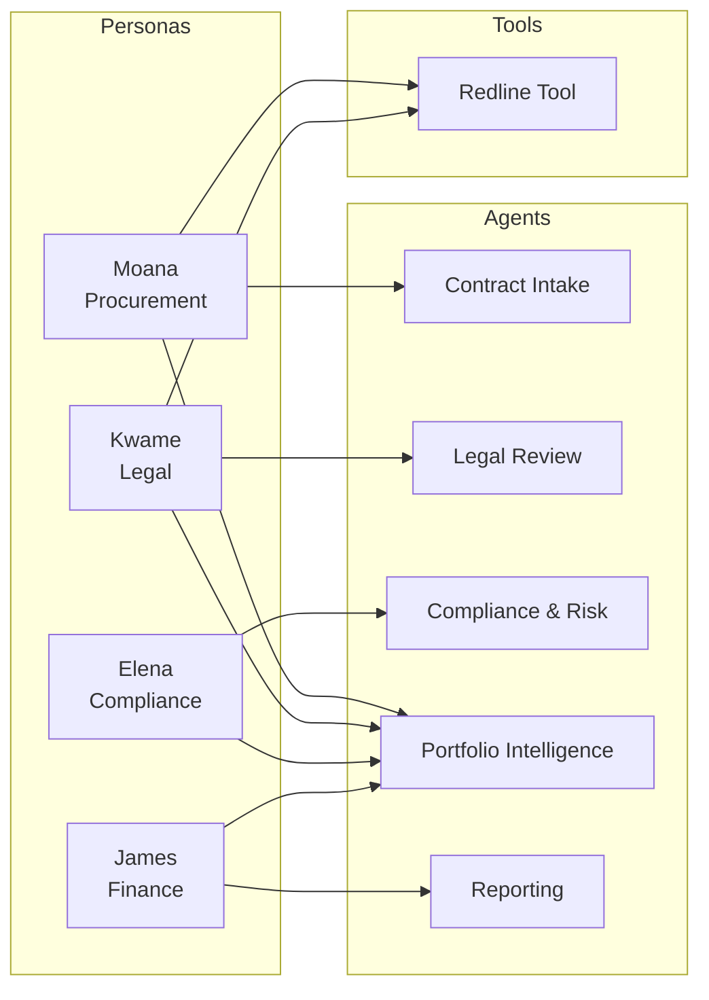

# Contoso Contract Management — Persona Profiles

Demo personas representing the key stakeholders in Contoso's contract lifecycle. Each persona maps to specific agents and capabilities in the multi-agent solution.

## Personas

| Persona | Role | Primary Agents | Demo Focus |
|---------|------|---------------|------------|
| [Moana Tuilagi](moana-tuilagi.md) | Senior Procurement Officer | Intake, Portfolio Intelligence, Redline Tool | End-to-end contract submission and vendor negotiation |
| [Kwame Osei-Mensah](kwame-osei-mensah.md) | Associate General Counsel | Legal Review, Portfolio Intelligence, Redline Tool | Playbook review, precedent lookup, redline generation |
| [Elena Vasquez](elena-vasquez.md) | Chief Compliance Officer | Compliance & Risk, Portfolio Intelligence | Compliance screening, trend analysis, incident tracking |
| [James Chen](james-chen.md) | VP of Finance | Portfolio Intelligence, Reporting | Spend analytics, budget variance, financial approval |

## Agent Coverage Map

## Demo Flow

A typical demo walks through the Meridian Consulting MSA ($850K) touching all four personas:

1. **Moana** submits the contract → Intake classifies it as high-value MSA
2. **Kwame** reviews the Legal Review output → flags missing liability cap, triggers redline
3. **Elena** checks compliance screening → verifies insurance gaps, reviews incident history
4. **James** reviews the executive summary → pulls spend benchmarks, approves with conditions
